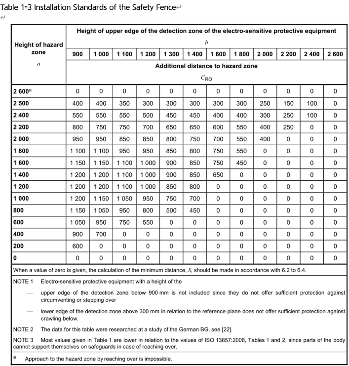

# 1.10.1. 安装安全围栏


当机器人在操作时，存在机器人与工作人员之间的碰撞风险。因此，请安装安全围栏以防止工作人员靠近机器人。


当机器人在操作时，存在机器人与工作人员之间的碰撞风险。因此，请根据 ISO 13855:2010 安装安全围栏，以防止工作人员靠近机器人。配置系统以确保在机器人操作期间，当工作人员打开安全围栏的门并接近设施时，机器人会停止，无论出于任何原因，例如检查机器人或焊接夹具、进行刀具修整或更换刀具等。

图 1.4 安全围栏的连接  

来源：ISO 13855:2010 机械安全 - 针对人体部位接近速度的防护装置定位

来源：ISO 13855:2010 机械安全 - 针对人体部位接近速度的防护装置定位

* 安全围栏应覆盖机器人的操作区域，并应留出足够的空间，以便工作人员进行教学、维护等工作时没有干扰。安全围栏应坚固，以防止轻易移动，并应设计成不允许人员从安全围栏上方进入围栏内部的方式。

* 原则上，要求安装和使用没有不安全部件（如不平或锋利部件）的固定式安全围栏。

* 应安装入口门，以使人员能够进入安全围栏内部，门上必须安装安全插头，以确保在未移除插头时门无法打开。此外，布线应配置为在移除安全插头或打开安全围栏时，使电机停止并保持制动状态。

* 如果希望在移除安全插头时仍能操作机器人，则应配置布线，以允许机器人以低速运行。

* 将机器人的紧急停止按钮安装在操作员可以迅速按压的位置。

* 如果不打算安装安全围栏，则应安装诸如光电开关和垫开关等安全装置，覆盖落在机器人安全防护范围规范内的整个区域，作为安全围栏的替代设备，使机器人在人员进入安全围栏时能够自动停机。

* 确保机器人的操作区域（危险区域）能够以某种方式识别，例如在地面上涂色。