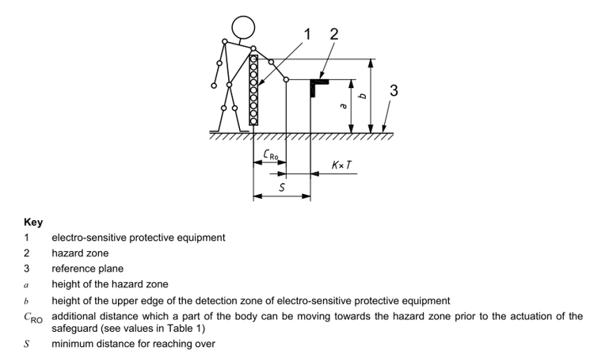

# 1.10.1. Installing the Safety Guard


When the robot is operating, there is a risk of collision between the robot and the worker. Therefore, install a safety fence to prevent a worker from getting close to the robot.


When the robot is operating, there is a risk of collision between the robot and the worker. Therefore, install a safety fence to prevent a worker from getting close to the robot according to ISO 13855:2010. Configure the system to ensure that the robot stops when a worker opens the door of the safety fence and approaches the facility, during the robot operation, for any reason, such as inspecting the robot or a welding fixture, performing tip dressing or tip changing, etc.

Figure 1.4 Connection of the Safety Fence  

Source : ISO 13855:2010 Safety of machinery — Positioning of safeguards with respect to the approach speeds of parts of the human body

Source : ISO 13855:2010 Safety of machinery - Positioning of safeguards with respect to the approach speeds of parts of the human body

*   The safety fence should cover the operation area of the robot, and should secure enough space so that there is no interference when the worker carries out works, such as teaching, maintenance,  etc. The safety fence should be made solid to prevent it from being moved easily and should be structured in a way not to allow people to enter inside the fence by going over the safety fence.

*	In principle, it is required to install and use a fixed type safety fence that does not have dangerous parts such as uneven or sharp parts.

*	An entrance door should be installed to allow people to enter inside the safety fence, and a safety plug must be installed on the door in a way that the door should not open unless the plug is removed. In addition, wiring should be configured in a way that allows the motor to be turned off and the brake to be in hold state when the safety plug is removed or the sfety fence is opened.

*	If you want to operate the robot even when the safety plug is removed, wiring should be configured in a way that allows the robot to play back at low speed.

*	Install the emergency stop button of the robot at a location where the operator can quickly press it.

*	If a safety fence is not to be installed, safety devices such as photoelectric switches and mat switches should be installed covering the entire area that falls within the specification of the safety guard range of the robot, as substitute devices for the safety fence, making it possile for the robot to stop automatically when a person enters inside the safety fence. 

*	Make sure that the robot's operation area (danger area) can be identified in some way, such as painting the floor.

