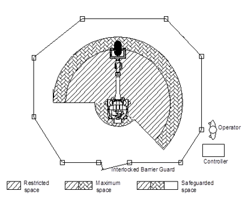

# 1.10.2. Placement of the Robot and Peripheral Devices 


The robot should be installed and operated according to the guidelines of ISO 10218-2. In addition, it is required to comply with the relevant requirements of international standards and national laws. 
Our company (or the manufacturer) will not be responsible for any accidents that occur due to not complying with the relevant requirements of international standards and national laws or due to not reviewing the “risk assessment”.



Installation of the product should be performed by a qualified installer according to relevant national and local regulations and laws.

*	When unpacking the product, check it for damage that may occur while transporting or unpacka it.

*	Before installing the product after unpacking it, you must check the safety regulations, instructions, information related to the product installation and use environments, and fully understand the installation methods.

*	When connecting the primary power of the controller or peripheral device, perform the connection after checking first whether the supply side power is turned off. Since high voltage is used as the primary power source, there is a risk of electric shock.

*	Put up a sign “No entry during operation” at the entrance of the safety fence, and inform the workers of the intents.

*	Place the controller, interlock panels, and other control panels in a way that they can be operated from outside the safety fence.

*	When installing the operation stand, attach an emergency stop button to it also. Wherever you operate the robot, you should be able to stop the robot in an emergency situation.

*	Do not allow the wiring or piping of the manipulator, controller, interlock panel, timer, etc. to get caught on by the workers' feet or to get stepped on directly by the forklift. Otherwise, there is a risk of accidents of the worker getting electric shock or the wires getting disconnected. 

*	Place the controller, interlock panel, and operation stand at a place where the operation of the manipulator can be seen sufficiently. If the robot is operating abnormally in an area from which the robot operation cannot be seen, or the worker is working on something in the area, there is a risk of major accidents taking place during operation.

*	If the required robot operation area is narrower than the allowable robot operation area, you should limit the robot operation area. It can be limited by soft limit, hardware limit, mechanical stopper, etc. Even when the robot operates off the normal operation area due to abnormal operation such as mistakes in the operation of the robot, the robot will be stopped in advance by the operation area limit function. 

*	During welding, spatter may fall on or fall near the worker and cause a burn or fire. Install a light shield plate, cover, etc. in the range where the movement of the manipulator can be seen sufficiently.

*	When it comes to a device that shows the auto and manual operation modes of the robot, an easily visible device should be installed to ensure that the status can be recognized from a distance. In case of starting the operation in auto mode, a buzzer or an alarm will be useful.

*	Make sure there is no protruding part on the peripheral devices of the robot. If necessary, place a cover on them. Otherwise, in general, an accident could occur when the worker comes into contact with a protruding part, and a major accident could occur when a worker surprised over a sudden movement of the robot could fall over. 

*	Do not design a system that requires the worker to put in hands inside the safety fence to carry in and carry out a workpiece.

Placement of the Peripheral Devices and Workers for the Industrial Robot

Figure 1.5 Cylinder Type Safety Fence for the Industrial Robot
