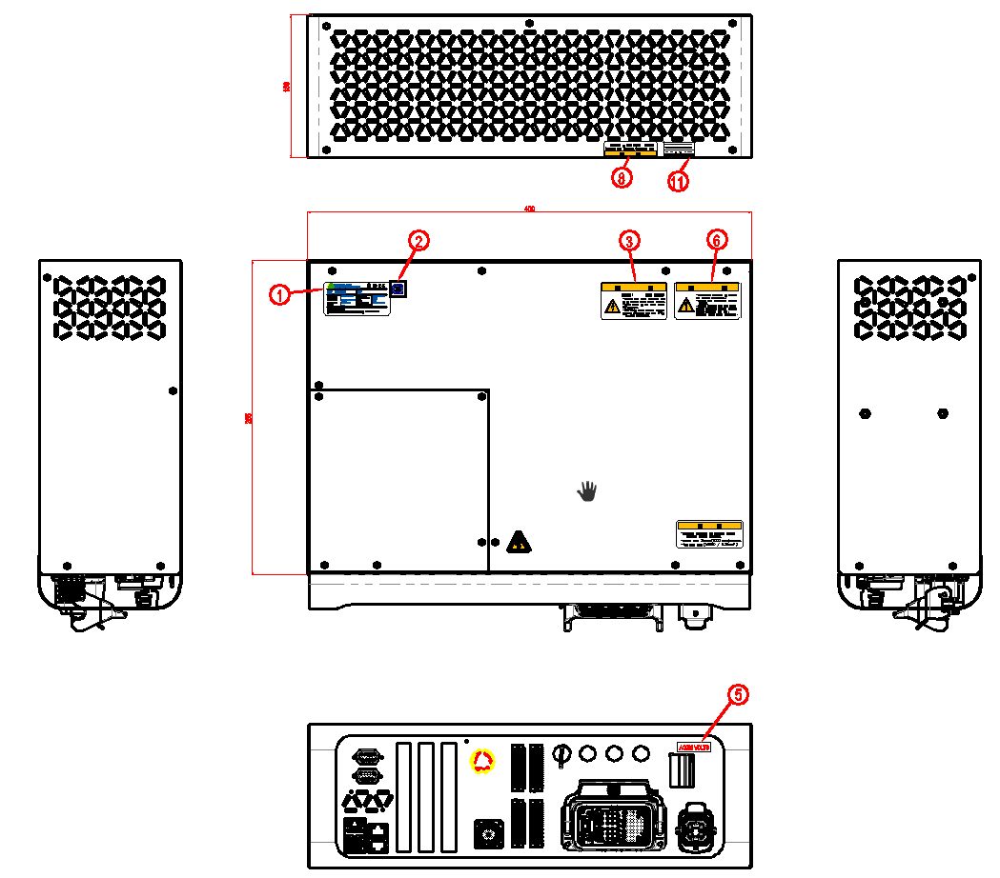

# 1.7. 安全标签 

铭牌、警告标记、安全符号等附着在控制器的内外侧。任何损坏安全标签的行为，例如重新定位铭牌、警告标记、安全符号、名称标记和电线标记，或在其上喷漆或用遮罩遮挡，都是被禁止的。以一种可以在类型、颜色和风格上与其他设备区分开来的方式标记机器人安装和危险区域。

图 1.1 安全标签

表 1-2 安全标签

.png)

-표_1-2_안전라벨.png)

-표_1-2_안전라벨2.png)


任何损坏安全标签的行为，例如重新定位铭牌、警告标记、安全符号、名称标记和电线标记，或在其上喷漆或用遮罩遮挡，都是被禁止的。



以一种可以在类型、颜色和风格上与其他设备区分开来的方式标记机器人安装和危险区域。
