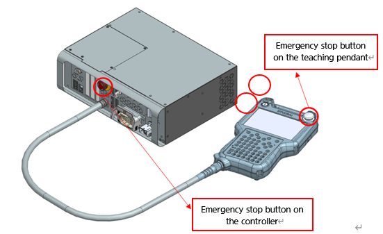
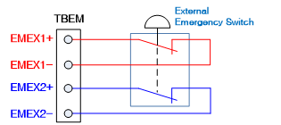

# 1.8.1. Main Safety Functions

* Emergency stop (IEC 60204-1,10,7)

There is one emergency stop button on the controller and teach pendant respectively. It is possible to connect, if necessary, an additional emergency button to the safety chain circuit of the robot. The emergency stop function is to be applied with higher priority over all other control functions of the robot. The function will immediately cut off the power supply to the motors of individual axes of the robot, stopping the robot and making it impossible to use safety related functions controlled by the robot.


As the emergency stop function immediately cuts off the motor power, so reckless use of the function may result in accumulation of fatigue that affects the durability of the robot. The function must be used only in emergency situations.


Figure 1.2 Emergency Stop Buttons on the Controller and Teach pendant

Figure 1.3 Connection of an Additional Emergency Stop Device

*	Protective stop (ISO 10218-1:2011)

The robot should have multiple safety inputs so that it can be used in connection with external safety devices such as safety guards, safety pads, and safety lamps. These safety inputs will make the robot stop when there is an input from the robot itself and peripheral facilities, securing a safe state. For details on the connection to the safety inputs, refer to “4.3.2. Safety Module (BD632)”.

*   Speed limit (EN ISO 10218-1:2011)

In manual operation mode, the speed of the robot is limited to a maximum of 250 mm / s. The speed limit applies not only to the TCP (Tool Center Point) but also to all other parts of the robot that are to be operated in manual mode. It should be also made possible to monitor the speed of the equipment mounted on the robot.

*  Operation area limit (ANSI/RIA R15.06-2012)

When applying a robot, in order to secure a sufficient safety area, the operation range of the robot can be limited by using a hardware limit or a stopper. This function can minimize the damage if the robot collides with an external safety device such as a safety guard. Axis 1, 2, and 3 are mainly limited by a stopper or hardware limit. If the operation range is changed due to a mechanical stopper or hardware limit, the operation range limit parameter should be also changed in software as well. Please refer to the operation manual about the change. The operation area limit of each axis can be changed by the user, and at the time of shipment, it is set to the maximum operation range of the robot. The safety system of the Hi6 controller can support up to 4 hardware limit switches as an option. Refer to “4.3.2. Please refer to “Safety Module (BD632)” for the matters related to the connection.

*  Operation mode selection (ANSI/RIA R15.06-2012)

You can operate the robot in manual, automatic or remote mode. The maximum speed in manual mode is limited to 250 mm/s, and you can perform operation only with the Teach pendant. In addition, it is possible to mount a mode switch additionally on the control panel by configuring it as an option. For details on the operation, please refer to the operation manual.

