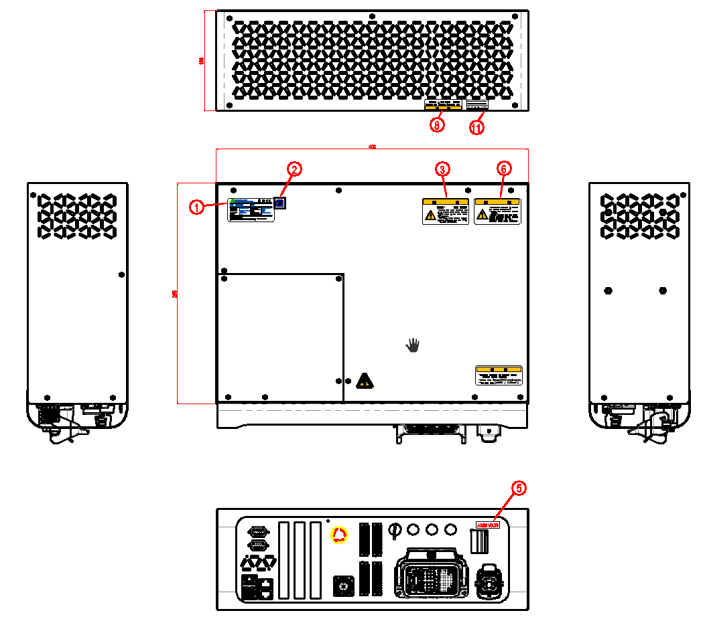
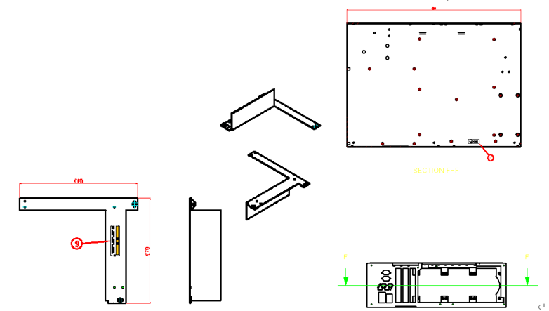

# 3.1.2. 각종 명판의 확인

그림 3.2 제어기 라벨

  

표 3-1 라벨 종류

-표_1-2_안전라벨.png)

.png)

-표_1-2_안전라벨2.png)


제어기에 부착된 명판, 경고 표시, 안전 기호, 명칭 표시, 전선 마크 등의 위치를 옮기거나 페인트칠 및 커버를 씌워 가리는 행위 등 안전 라벨에 손상을 주는 일체의 행위를 금합니다.



로봇의 설치 영역 및 위험 지역은 형태나 색상, 스타일에서 차이를 두어 다른 시설 및 기기와 명확히 구분되도록 표시하십시오.
