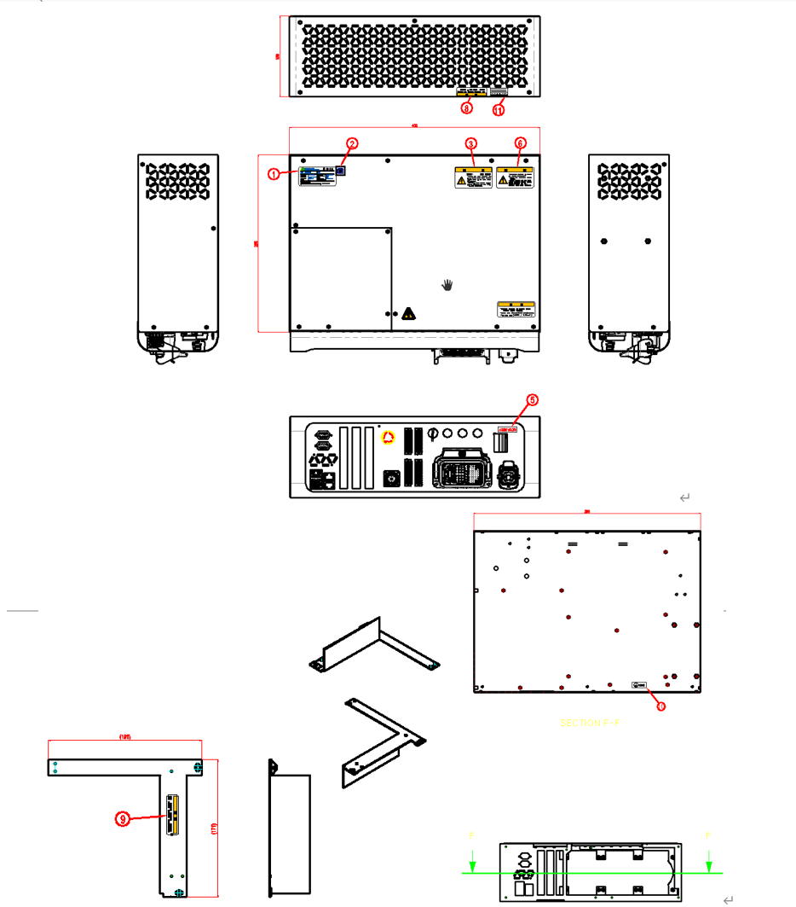

# 3.1.2. Checking of Various Name Plates

Figure 3.2 Controller’s Labels   

Table 3-1 Label Type

.png)

-표_1-2_안전라벨.png)

-표_1-2_안전라벨2.png)


Any act of damaging the safety labels, such as relocating the name plates, warning markings, safety symbols, name markings and wire markings or painting over them or blocking them with a cover is prohibited. 



Mark the installation and dangerous areas of the robot in a way that they can be differentiated from other facilities and devices in terms of type, color and style.
