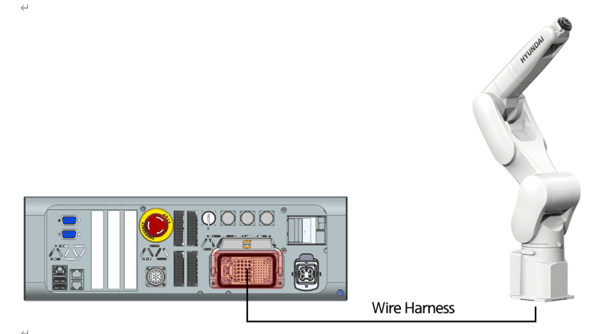

# 3.6.2. 로봇 본체와 제어기의 접속

로봇 본체와 제어기간의 연결은 와이어하네스(wire harness)로 연결합니다. 각각의 리셉터클 명칭을 확인하시고 연결하여 주십시오.


로봇별로 커넥터 접촉부가 위의 그림과 상이 할 수 있으므로 반드시 와이어하네스(Wire Harness) 연결 전 해당 로봇 보수 매뉴얼을 숙독하여 연결을 하십시오.


그림 3.4 로봇 본체와 제어기의 접속 (Hi6-T15)
