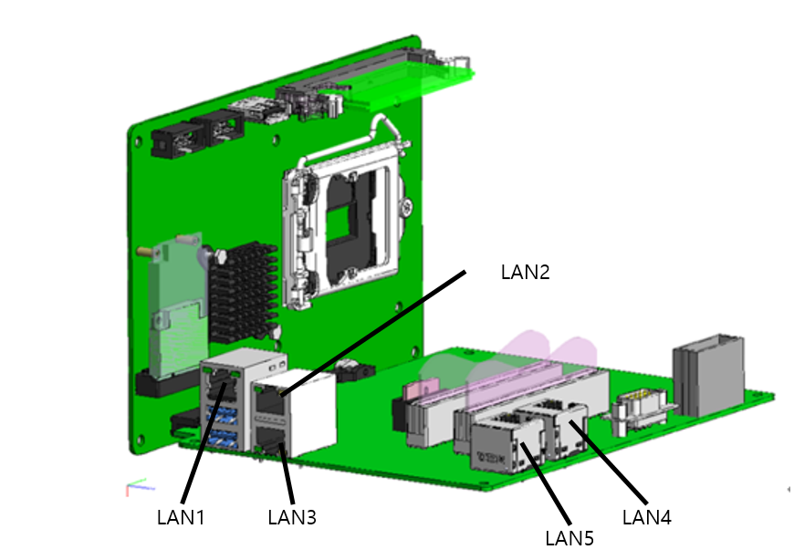

# 4.3.1.1. 개요

H6COM-T는 은 그림 4.3과 같은 구조로서 Main CPU보드와 Carier보드의 결합으로 이루어져 있습니다. Main CPU 보드는 SSD 슬롯, CPU슬롯, 메모리카드 슬롯, DP포트, COM포트 와 Carrier보드를 체결하는 버스커넥터로 구성되어 있습니다. Carier보드는 3개의 외부 LAN포트, 2개의 내부 시스템용 LAN포트 2개의USB포트, GPIO포트, 2개의 PCI 커넥터, 1개의 PCI-e커넥터와 DC 24V전원 커넥터를 포함하고 있습니다. 내부 시스템 LAN포트는 EtherCAT통신과 Teach Pandent와의 인터페이스를 위한 목적으로 사용되며, GIO는 전원장치로부터 정전신호를 감지하기 위해 사용됩니다. DP포트와 USB는 디버깅 목적으로 쓰입니다. 기타 범용적인 버스 인터페이스를 지원하기 위해 PCI 확장슬롯과 외부의 LAN포트 여분 3포트를 제공하며, 해당 슬롯을 통해 EtherCAT 외의 다른 통신인터페이스 들과 연결될 수 있습니다.

그림 4.3 H6COM의 3D 모델링
