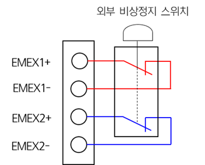

# 4.3.2.5. 紧急停止连接

(1) 外部紧急停止接触输入类型

外部紧急停止装置 (EMEX) 设计为无论控制器模式（自动或手动）如何均可操作，并由 BD632（安全 IO 板）持续监控。当安全输入到达时，电机电源将被切断，以将机器人置于安全状态。外部紧急停止开关应按照下图所示以接触输出的形式连接和使用。

图 4.9 将外部紧急停止开关连接到终端块 TBEM 的方法

如果不使用外部紧急停止，请如下面所示连接终端块 TBEM 的端子（将 TBEM 连接器的引脚 9-1 和 10-2 连接），以禁用输入。

_TBEM.png)

图 4.10 不使用外部紧急停止接触输入类型时的处理方法


如果要安装和使用外部紧急停止，必须在确认紧急停止正常工作后操作机器人。此外，要检查紧急停止输入是否已禁用。这是为确保工人安全必须提前采取的基本措施。
