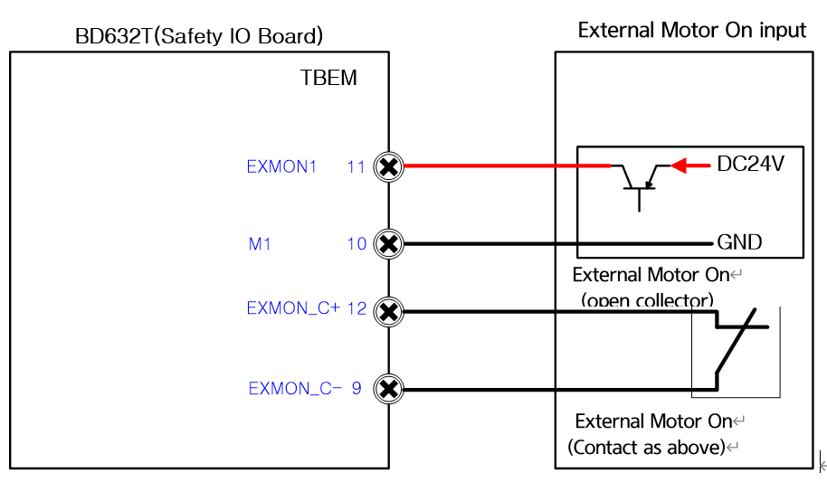

# 4.3.2.8. Connection of the External Motor On Signal

Figure 4.16 Method to Connect the External Motor On Signal 

(1)	External Motor On Signal

When using a motor on signal input from the outside of the controller, the relevant connection should be configured in the form of an open collector or contact as above.
