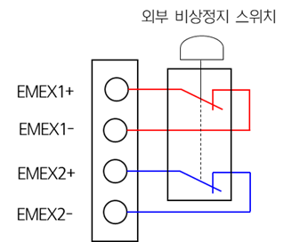

# 4.3.2.5. 비상정지의 연결

(1\)    접점입력 외부비상정지 

외부비상정지(EMEX)는 제어기의 모드(자동, 수동)에 무관하게 작동되도록 설계 되어 있으며, BD632T(Safety IO Board)에 의해 지속적으로 모니터링됩니다. 안전 입력이 들어오면, 모터 파워를 제거하여 로봇을 안전한 상태로 만듭니다. 
외부 비상 정지 스위치의 연결은 아래 그림과 같이 접점출력의 형태로 사용하여야 합니다.

그림 4.9 터미널블록 TBEM에 외부비상정지 스위치를 연결하는 방법

외부 비상정지를 사용하지 않을 경우에는 다음과 같은 방법으로 터미널블록TBEM의 단자(TBEM 커넥터의 9-1, 10-2번 핀 연결)들을 연결하여 입력을 무효화시킵니다.

_TBEM.png  )

그림 4.10 접점입력 외부비상정지를 사용하지 않을 경우 조치방법


외부 비상정지를 설치하여 사용할 경우에는 비상정지가 정상적으로 작동되는지 확인 후 로봇을 가동시켜야 합니다. 또한 비상정지 입력이 무효화가 되어 있는지 확인하십시오. 이는 작업자의 안전을 위하여 반드시 필요한 사전조치 입니다.

