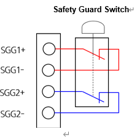
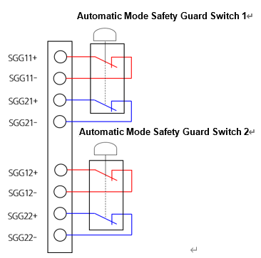

# 4.3.2.6. 안전가드의 연결

(1\)    일반안전가드

일반 안전가드는 제어기의 모드(자동, 수동)에 무관하게 작동하는 안전가드입니다. 즉 설치된 안전가드 내부로 사람이 진입하거나 가드가 끊어진 경우 제어기는 즉각적으로 모터파워를 제거합니다. 사용될 수 있는 안전가드는 접점출력의 형태가 되어야 합니다. 터미널블록 TBEM에는 다음의 그림처럼 이중화된 안전체인에 안전가드의 접점출력을 연결할 수 있도록 단자가 구성되어 있습니다.

그림 4.11 터미널블록 TBRMT에 일반 안전가드를 연결하는 방법

일반 안전가드를 사용하지 않을 경우에는 다음과 같은 방법으로 터미널블록TBEM의 단자(15-7, 16-8번 핀)들을 연결하여 입력을 무효화시킵니다.

_TBEM.png  )

그림 4.12 일반 안전가드를 사용하지 않을 경우 조치방법


일반 안전 가드를 설치하여 사용할 경우에는 비상정지가 정상적으로 작동되는지 확인 후 로봇을 가동시켜야 합니다. 또한 비상정지 입력이 무효화가 되어 있는지 확인하십시오. 이는 작업자의 안전을 위하여 반드시 필요한 사전조치 입니다.


\(2\)    접점입력 자동안전가드

자동 안전가드는 제어기가 자동모드에 있을 경우에만 작동하는 안전가드로서 아래와 같이 2개의 입력을 제공합니다. 일반 안전가드와 마찬가지로 접점출력의 형태이어야 합니다. 터미널블록 TBEM에는 다음의 그림처럼 이중화된 안전체인에 안전가드의 접점출력을 연결할 수 있도록 단자가 구성되어 있습니다.

그림 4.13 터미널블록 TBEM에 접점입력 자동 안전가드를 연결하는 방법

자동 안전가드를 사용하지 않을 경우에는 다음과 같은 방법으로 터미널블록TBEM의 단자(11-3, 12-4, 13-5, 14-6)들을 연결하여 입력을 무효화시킵니다.

_TBEM.png  )

그림 4.14 접점입력 자동 안전가드를 사용하지 않을 경우 조치방법


자동 안전 가드를 설치하여 사용할 경우에는 비상 정지가 정상적으로 작동되는지 확인 후 로봇을 가동시켜야 합니다. 또한 비상 정지 입력이 무효화가 되어 있는지 확인하십시오. 이는 작업자의 안전을 위하여 반드시 필요한 사전조치 입니다.

