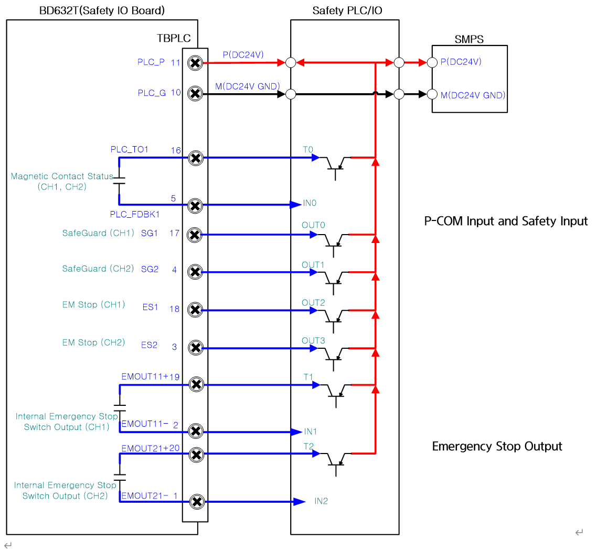

# 4.3.2.7. Safety PLC, IO의 연결

Safety PLC 또는 IO와 로봇제어기와는 다음과 같은 방법으로 비상입력신호와 모니터링 출력 신호들을 연결합니다.

그림 4.15 Safety PLC/IO의 연결방법

\(1\) P-COM 입력 안전입력

안전 PLC의 안전입력(ES, SG)은 터미널블럭 TBEM에서 PNP출력을 제어기가 입력 받을 수 있도록 설계되었습니다. 그런 이유로 반드시 PLC의 전원(DC24V)전원을 연결 후 사용 해야 합니다.


안전 입력을 설치하여 사용할 경우에는 정상적으로 기능이 작동하는지 확인 후 로봇을 가동시켜야 합니다. 이는 작업자의 안전을 위하여 반드시 필요한 사전 조치입니다.


\(2\) 비상정지출력

제어기 내부에 설치된 비상정지스위치(조작패널, 티치펜던트 등)의 상태를 외부장치에서 사용하고자 할 때에는 PNP출력을 제어기가 ON/OFF하여 사용할 수 있도록 설계 되었습니다.


비상정지 출력을 설치하여 사용할 경우에는 비상 정지 출력이 정상적으로 작동되는지 확인 후 로봇을 작동하십시오. 이는 작업자의 안전을 위하여 반드시 필요한 사전 조치입니다.

