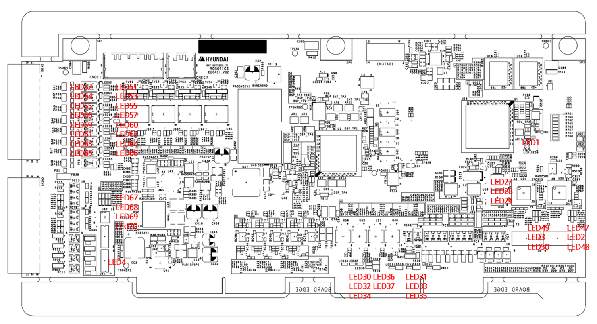
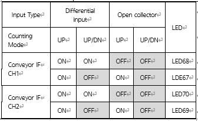

# 4.3.3.3. Display Devices

 The placement of the display devices of the servo control board (BD641T) is as shown in the following figure, and each use is shown in Table 4-9.

 

Table 4-9 LEDs of the Servo Board (BD641T)

<table>
<tbody>
<tr class="odd">
<td>
<strong>Status</strong>

<strong>Name</strong>
</td>
<td>
<strong>Contents of display</strong>
</td>
<td>
<strong>Color</strong>
</td>
<td>
<strong>When normal</strong>
</td>
<td>
<strong>Actions to take when an abnormality occurs</strong>
</td>
</tr>
<tr class="even">
<td>
<strong>LED1</strong>
</td>
<td>
FPGA operation state
</td>
<td>
Green
</td>
<td>
Blinking
</td>
<td>
Phenomenon: Turned off Action 1: Check the input voltage (24V). 
Action 2: When turned off, check the fuse. Action 3: Replace BD641T.
</td>
</tr>
<tr class="odd">
<td>
<strong>LED2</strong>
</td>
<td>
EtherCAT In Speed
</td>
<td>
Green
</td>
<td>
Blinking
</td>
<td>
Phenomenon: Turned off Action 1: Check the input voltage (24V). 
Action 2: Inspect the EtherCAT communication line. Action 3: Replace BD641T.

</td>
</tr>
<tr class="even">
<td>
<strong>LED3</strong>
</td>
<td>
EtherCAT Out Speed
</td>
<td>
Green
</td>
<td>
Blinking
</td>
<td>
Phenomenon: Turned off Action 1: Check the input voltage (24V). 
Action 2: Inspect the EtherCAT communication line. Action 3: Replace BD641T.
</td>
</tr>
<tr class="odd">
<td>
<strong>LED4</strong>
</td>
<td>
24V power input
</td>
<td>
Green
</td>
<td>
Turned on
</td>
<td>
Phenomenon: Turned off Action 1: Check the input voltage (24V). 
Action 2: When turned off, check the fuse. Action 3: Replace BD641T.

</td>
<tr class="even">
<td>
<strong>LED30</strong>
</td>
<td>
Display of Axis 3 motor on
</td>
<td>
Green
</td>
<td>
Turned on
</td>
<td>
-
</td>
</tr>
<tr class="odd">
<td>
<strong>LED31</strong>
</td>
<td>
Display of Axis 6 motor on
</td>
<td>
Green
</td>
<td>
Turned on
</td>
<td>
-

</td>
</tr>
<tr class="even">
<td>
<strong>LED32</strong>
</td>
<td>
Display of Axis 2 motor on
</td>
<td>
Green
</td>
<td>
Turned on
</td>
<td>
-
</td>
</tr>
<tr class="odd">
<td>
<strong>LED33</strong>
</td>
<td>
Display of Axis 5 motor on
</td>
<td>
Green
</td>
<td>
Turned on
</td>
<td>
-

</td>
</tr>
<tr class="even">
<td>
<strong>LED34</strong>
</td>
<td>
Display of Axis 5 motor on
</td>
<td>
Green
</td>
<td>
Turned on
</td>
<td>
-
</td>
</tr>
<tr class="odd">
<td>
<strong>LED35</strong>
</td>
<td>
Display of Axis 4 motor on
</td>
<td>
Green
</td>
<td>
Turned on
</td>
<td>
-

</td>
</tr>
<tr class="even">
<td>
<strong>LED36</strong>
</td>
<td>
Display of Axis 8 motor on
</td>
<td>
Green
</td>
<td>
Turned on
</td>
<td>
-
</td>
</tr>
<tr class="odd">
<td>
<strong>LED37</strong>
</td>
<td>
Display of Axis 7 motor on
</td>
<td>
Green
</td>
<td>
Turned on
</td>
<td>
-

</td>
</tr>
<tr class="even">
<td>
<strong>LED47</strong>
</td>
<td>
EtherCAT In LINK
</td>
<td>
Green
</td>
<td>
Blink
</td>
<td>
Phenomenon : Turned off

Action1 : Check the input voltage (24V)

Action2 : Inspect the EtherCAT communication line.

Action3 : Replace BD641T
</td>
</tr>
<tr class="odd">
<td>
<strong>LED48</strong>
</td>
<td>
EtherCAT In ACT
</td>
<td>
Green
</td>
<td>
Blink
</td>
<td>
Phenomenon : Turned off

Action1 : Check the input voltage (24V)

Action2 : : Inspect the EtherCAT communication line.

Action3 : Replace BD641T
</td>
</tr>
<tr class="even">
<td>
<strong>LED49</strong>
</td>
<td>
EtherCAT Out LINK
</td>
<td>
Green
</td>
<td>
Blink
</td>
<td>
Phenomenon : Turned off

Action1 : Check the input voltage (24V)

Action2 : Inspect the EtherCAT communication line.

Action3 : Replace BD641T
</td>
</tr>
<tr class="odd">
<td>
<strong>LED50</strong>
</td>
<td>
EtherCAT Out ACT
</td>
<td>
Green
</td>
<td>
Blink
</td>
<td>
Phenomenon : Turned off

Action1 : Check the input voltage (24V)

Action2 : : Inspect the EtherCAT communication line.

Action3 : Replace BD641T
</td>
</tr>
<tr class="even">
<td>
<strong>LED51</strong>
</td>
<td>
Digital input channel 1
</td>
<td>
Green
</td>
<td>
Turned on
</td>
<td>
-
</td>
</tr>
<tr class="odd">
<td>
<strong>LED52</strong>
</td>
<td>
Digital input channel 1
</td>
<td>
Green
</td>
<td>
Turned on
</td>
<td>
-

</td>
</tr>
<tr class="even">
<td>
<strong>LED53</strong>
</td>
<td>
Digital input channel 2
</td>
<td>
Green
</td>
<td>
Turned on
</td>
<td>
-
</td>
</tr>
<tr class="odd">
<td>
<strong>LED54</strong>
</td>
<td>
Digital input channel 2
</td>
<td>
Green
</td>
<td>
Turned on
</td>
<td>
-

</td>
</tr>
<tr class="even">
<td>
<strong>LED55</strong>
</td>
<td>
Digital input channel 3
</td>
<td>
Green
</td>
<td>
Turned on
</td>
<td>
-
</td>
</tr>
<tr class="odd">
<td>
<strong>LED56</strong>
</td>
<td>
Digital input channel 3
</td>
<td>
Green
</td>
<td>
Turned on
</td>
<td>
-

</td>
</tr>
<tr class="even">
<td>
<strong>LED57</strong>
</td>
<td>
Digital input channel 4
</td>
<td>
Green
</td>
<td>
Turned on
</td>
<td>
-
</td>
</tr>
<tr class="odd">
<td>
<strong>LED58</strong>
</td>
<td>
Digital input channel 4
</td>
<td>
Green
</td>
<td>
Turned on
</td>
<td>
-

</td>
</tr>
<tr class="even">
<td>
<strong>LED59</strong>
</td>
<td>
Digital input channel 5
</td>
<td>
Green
</td>
<td>
Turned on
</td>
<td>
-
</td>
</tr>
<tr class="odd">
<td>
<strong>LED60</strong>
</td>
<td>
Digital input channel 5
</td>
<td>
Green
</td>
<td>
Turned on
</td>
<td>
-

</td>
</tr>
<tr class="even">
<td>
<strong>LED61</strong>
</td>
<td>
Digital input channel 6
</td>
<td>
Green
</td>
<td>
Turned on
</td>
<td>
-
</td>
</tr>
<tr class="odd">
<td>
<strong>LED62</strong>
</td>
<td>
Digital input channel 6
</td>
<td>
Green
</td>
<td>
Turned on
</td>
<td>
-

</td>
</tr>
<tr class="even">
<td>
<strong>LED63</strong>
</td>
<td>
Digital input channel 7
</td>
<td>
Green
</td>
<td>
Turned on
</td>
<td>
-
</td>
</tr>
<tr class="odd">
<td>
<strong>LED64</strong>
</td>
<td>
Digital input channel 7
</td>
<td>
Green
</td>
<td>
Turned on
</td>
<td>
-

</td>
</tr>
<tr class="even">
<td>
<strong>LED65</strong>
</td>
<td>
Digital input channel 8
</td>
<td>
Green
</td>
<td>
Turned on
</td>
<td>
-
</td>
</tr>
<tr class="odd">
<td>
<strong>LED66</strong>
</td>
<td>
Digital input channel 8
</td>
<td>
Green
</td>
<td>
Turned on
</td>
<td>
-

</td>
</tr>
<tr class="even">
<td>
<strong>LED67 LED68</strong>
</td>
<td>
Conveyor IF channel 1
</td>
<td>
Green
</td>
<td>
-
</td>
<td>

</td>
</tr>
<tr class="odd">
<td>
<strong>LED69 LED70</strong>
</td>
<td>
Conveyor IF channel 2
</td>
<td>
Green
</td>
<td>
-
</td>
<td>

</td>
</tr>
</tbody>
</table>

</tr>
</tbody>
</table>
