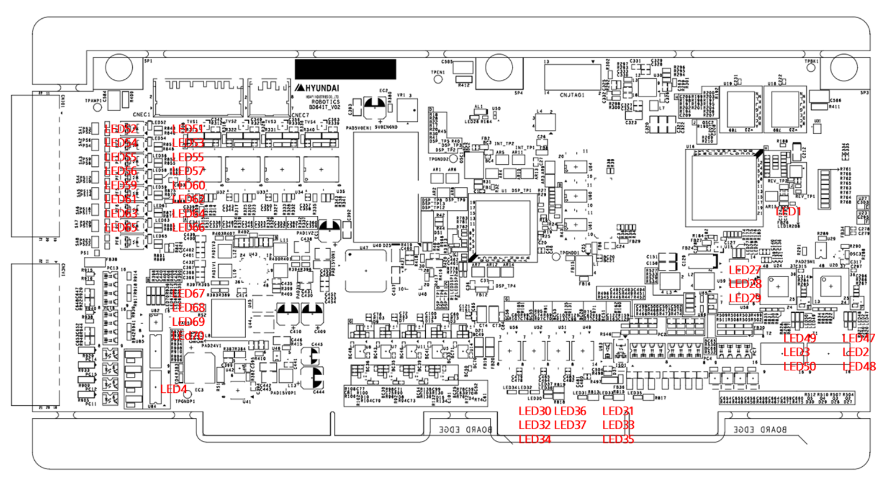

# 4.3.3.3. 显示设备

伺服控制板（BD641T）的显示设备放置如下面的图所示，每个用途见表4-9。

 

表4-9 伺服板（BD641T）的LED

<table>
<tbody>
<tr class="odd">
<td>
<strong>状态</strong>

<strong>名称</strong>
</td>
<td>
<strong>显示内容</strong>
</td>
<td>
<strong>颜色</strong>
</td>
<td>
<strong>正常时</strong>
</td>
<td>
<strong>发生异常时采取的措施</strong>
</td>
</tr>
<tr class="even">
<td>
<strong>LED1</strong>
</td>
<td>
FPGA运行状态
</td>
<td>
绿色
</td>
<td>
闪烁
</td>
<td>
现象：熄灭 措施 1：检查输入电压（24V）。 
措施 2：熄灭时检查保险丝。 措施 3：更换BD641T。
</td>
</tr>
<tr class="odd">
<td>
<strong>LED2</strong>
</td>
<td>
EtherCAT输入速度
</td>
<td>
绿色
</td>
<td>
闪烁
</td>
<td>
现象：熄灭 措施 1：检查输入电压（24V）。 
措施 2：检查EtherCAT通信线路。 措施 3：更换BD641T。

</td>
</tr>
<tr class="even">
<td>
<strong>LED3</strong>
</td>
<td>
EtherCAT输出速度
</td>
<td>
绿色
</td>
<td>
闪烁
</td>
<td>
现象：熄灭 措施 1：检查输入电压（24V）。 
措施 2：检查EtherCAT通信线路。 措施 3：更换BD641T。
</td>
</tr>
<tr class="odd">
<td>
<strong>LED4</strong>
</td>
<td>
24V电源输入
</td>
<td>
绿色
</td>
<td>
点亮
</td>
<td>
现象：熄灭 措施 1：检查输入电压（24V）。 <<
Action 2: 关闭时检查保险丝。 Action 3: 更换 BD641T。

</td>
<tr class="even">
<td>
<strong>LED30</strong>
</td>
<td>
轴 3 电机的显示
</td>
<td>
绿色
</td>
<td>
已开启
</td>
<td>
-
</td>
</tr>
<tr class="odd">
<td>
<strong>LED31</strong>
</td>
<td>
轴 6 电机的显示
</td>
<td>
绿色
</td>
<td>
已开启
</td>
<td>
-

</td>
</tr>
<tr class="even">
<td>
<strong>LED32</strong>
</td>
<td>
轴 2 电机的显示
</td>
<td>
绿色
</td>
<td>
已开启
</td>
<td>
-
</td>
</tr>
<tr class="odd">
<td>
<strong>LED33</strong>
</td>
<td>
轴 5 电机的显示
</td>
<td>
绿色
</td>
<td>
已开启
</td>
<td>
-

</td>
</tr>
<tr class="even">
<td>
<strong>LED34</strong>
</td>
<td>
轴 5 电机的显示
</td>
<td>
绿色
</td>
<td>
已开启
</td>
<td>
-
</td>
</tr>
<tr class="odd">
<td>
<strong>LED35</strong>
</td>
<td>
轴 4 电机的显示
</td>
<td>
绿色
</td>
<td>
已开启
</td>
<td>
-

</td>
</tr>
<tr class="even">
<td>
<strong>LED36</strong>
</td>
<td>
轴 8 电机的显示
</td>
<td>
绿色
</td>
<td>
已开启
</td>
<td>
-
</td>
</tr>
<tr class="odd">
<td>
<strong>LED37</strong>
</td>
<td>
轴 7 电机显示开启
</td>
<td>
绿色
</td>
<td>
已开启
</td>
<td>
-

</td>
</tr>
<tr class="even">
<td>
<strong>LED47</strong>
</td>
<td>
EtherCAT 输入连接
</td>
<td>
绿色
</td>
<td>
闪烁
</td>
<td>
现象：已关闭

操作1：检查输入电压（24V）

操作2：检查 EtherCAT 通信线路。

操作3：更换 BD641T
</td>
</tr>
<tr class="odd">
<td>
<strong>LED48</strong>
</td>
<td>
EtherCAT 输入活动
</td>
<td>
绿色
</td>
<td>
闪烁
</td>
<td>
现象：已关闭

操作1：检查输入电压（24V）

操作2：检查 EtherCAT 通信线路。

操作3：更换 BD641T
</td>
</tr>
<tr class="even">
<td>
<strong>LED49</strong>
</td>
<td>
EtherCAT 输出连接
</td>
<td>
绿色
</td>
<td>
闪烁
</td>
<td>
现象：已关闭

操作1：检查输入电压（24V）

操作2：检查 EtherCAT 通信线路。

操作3：更换 BD641T
</td>
</tr>
<tr class="odd">
<td>
<strong>LED50</strong>
</td>
<td>
EtherCAT 输出活动
</td>
<td>
绿色
</td>
<td>
闪烁
</td>
<td>
现象：已关闭

操作1：检查输入电压（24V）

操作2：检查 EtherCAT 通信线路。

操作3：更换 BD641T
</td>
</tr>
<tr class="even">
<td>
<strong>LED51</strong>
</td>
<td>
数字输入通道 1
</td>
<td>
绿色
</td>
<td>
已开启
</td>
<td>
-
</td>
</tr>
<tr class="odd">
<td>
<strong>LED52</strong>
</td>
<td>
数字输入通道 1
</td>
<td>
绿色
</td>
<td>
已开启
</td>
<td>
-

</td>
</tr>
<tr class="even">
<td>
<strong>LED53</strong>
</td>
<td>
数字输入通道 2
</td>
<td>
绿色
</td>
<td>
已开启
</td>
<td>
-
</td>
</tr>
<tr class="odd">
<td>
<strong>LED54</strong>
</td>
<td>
数字输入通道 2
</td>
<td>
绿色
</td>
<td>
已开启
</td>
<td>
-

</td>
</tr>
<tr class="even">
<td>
<strong>LED55</strong>
</td>
<td>
数字输入通道 3
</td>
<td>
绿色
</td>
<td>
已开启
</td>
<td>
-
</td>
</tr>
<tr class="odd">
<td>
<strong>LED56</strong>
</td>
<td>
数字输入通道 3
</td>
<td>
绿色
</td>
<td>
已开启
</td>
<td>
-

</td>
</tr>
<tr class="even">
<td>
<strong>LED57</strong>
</td>
<td>
数字输入通道 4
</td>
<td>
绿色
</td>
<td>
已开启
</td>
<td>
-
</td>
</tr>
<tr class="odd">
<td>
<strong>LED58</strong>
</td>
<td>
数字输入通道 4
</td>
<td>
绿色
</td>
<td>
已开启
</td>
<td>
-

</td>
</tr>
<tr class="even">
<td>
<strong>LED59</strong>
</td>
<td>
数字输入通道 5
</td>
<td>
绿色
</td>
<td>
已开启
</td>
<td>
-
</td>
</tr>
<tr class="odd">
<td>
<strong>LED60</strong>
</td>
<td>
数字输入通道 5
</td>
<td>
绿色
</td>
<td>
已开启
</td>
<td>
-

</td>
</tr>
<tr class="even">
<td>
<strong>LED61</strong>
</td>
<td>
数字输入通道 6
</td>
<td>
绿色
</td>
<td>
已开启
</td>
<td>
-
</td>
</tr>
<tr class="odd">
<td>
<strong>LED62</strong>
</td>
<td>
数字输入通道 6
</td>
<td>
绿色
</td>
<td>
已开启
</td>
<td>
-

</td>
</tr>
<tr class="even">
<td>
<strong>LED63</strong>
</td>
<td>
数字输入通道 7
</td>
<td>
绿色
</td>
<td>
已开启
</td>
<td>
-
</td>
</tr>
<tr class="odd">
<td>
<strong>LED64</strong>
</td>
<td>
数字输入通道 7
</td>
<td>
绿色
</td>
<td>
已开启
</td>
<td>
-

</td>
</tr>
<tr class="even">
<td>
<strong>LED65</strong>
</td>
<td>
数字输入通道 8
</td>
<td>
绿色
</td>
<td>
已开启
</td>
<td>
-
</td>
</tr>
<tr class="odd">
<td>
<strong>LED66</strong>
</td>
<td>
数字输入通道 8
</td>
<td>
绿色
</td>
<td>
已开启
</td>
<td>
-

</td>
</tr>
<tr class="even">
<td>
<strong>LED67 LED68</strong>
</td>
<td>
输送机接口通道 1
</td>
<td>
绿色
</td>
<td>
-
</td>
<td>

</td>
</tr>
<tr class="odd">
<td>
<strong>LED69 LED70</strong>
</td>
<td>
输送机接口通道 2
</td>
<td>
绿色
</td>
<td>
-
</td>
<td>

</td>
</tr>
</tbody>
</table>

</tr>
</tbody>
</table>