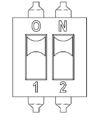
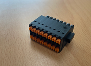

# 4.3.3.4. Setting Devices 


The DIP switch is set to OFF mode when shipped from the factory, and the setting should not be changed arbitrarily by the user.


Table 4-10 Method to Set the DIP Switch (DS1) of the Servo Board (BD641T) 

<table>
<thead>
  <tr>
    <th>Switch number</th>
    <th>1</th>
    <th>2</th>
    <th>Mode</th>
  </tr>
</thead>
<tbody>
  <tr>
    <td>Setting when shipped from the factory</td>
    <td>OFF</td>
    <td>OFF</td>
    <td>GET MODE</td>
  </tr>
  <tr>
    <td>When testing</td>
    <td>ON</td>
    <td>OFF</td>
    <td>WAIT MODE</td>
  </tr>
  <tr>
    <td>Switch exterior</td>
    <td colspan="3"></td>
  </tr>
</tbody>
</table>

  


The user cannot change the following items arbitrarily and needs to refer to them only when required to reprogram through FPGA JTAG.


Table 4-11 Description of the Jumper (JP1) of the Servo Board (BD641T) 

<table>
<thead>
  <tr>
    <th colspan="2" rowspan="2">Name Contents of the setting</th>
    <th colspan="4">JP1</th>
  </tr>
  <tr>
    <th>1</th>
    <th>2</th>
    <th>3</th>
    <th></th>
  </tr>
</thead>
<tbody>
  <tr>
    <td rowspan="2">Setting of the jumper</td>
    <td>QSPI (flash) boot mode</td>
    <td>⊙</td>
    <td>⊙</td>
    <td></td>
    <td></td>
  </tr>
  <tr>
    <td>JTAG programming mode</td>
    <td></td>
    <td>⊙</td>
    <td>⊙</td>
    <td></td>
  </tr>
  <tr>
    <td>Setting when shipped from the factory</td>
    <td colspan="5">Jumper 1~2, or no connection</td>
  </tr>
</tbody>
</table>
  

(1)	BD641T Conveyer Interface : TBCV

Figure 4.17 BD641T(Servo Control Board) TBCV


When performing activation by connecting a conveyor-related input, check whether the function works normally by referring to “1.11 Safety Measures When Operating the Robot.”


Table 4-12 Description of the BD641T(Servo Control Board) TBCV

<table>
<thead>
  <tr>
    <th>Terminal no</th>
    <th>Terminal name</th>
    <th>Use</th>
    <th>Input specification</th>
  </tr>
</thead>
<tbody>
  <tr>
    <td>11</td>
    <td>PA1+</td>
    <td rowspan="2">Channel 1
    
Line driver method

    
Conveyor phase A pulse input
</td>
    <td rowspan="2">0 ~ 5V, 100kHz or less</td>
  </tr>
  <tr>
    <td>12</td>
    <td>PA1-</td>
  </tr>
  <tr>
    <td>13</td>
    <td>PB1+</td>
    <td rowspan="2">Channel 1
    
Line driver method

    
Conveyor phase B pulse input
</td>
    <td rowspan="2">0 ~ 5V, 100kHz or less</td>
  </tr>
  <tr>
    <td>14</td>
    <td>PB1-</td>
  </tr>
  <tr>
    <td>15</td>
    <td>LD_LS1</td>
    <td rowspan="2">Channel 1
    
Line driver method

    
Limit switch input for detecting a workpiece
</td>
    <td rowspan="2">0 ~ -30V</td>
  </tr>
  <tr>
    </tr>
  <tr>
    <td>16</td>
    <td>GND_LS1</td>
    <td rowspan="2">Channel 1
    
Line driver method

    
Power GND input
</td>
    <td rowspan="2">0V</td>
  </tr>
  <tr>
  </tr>
  <tr>
    <td>17</td>
    <td>P1+</td>
    <td rowspan="2">Channel 1
    
Open-collector method 

    
Power input
</td>
    <td rowspan="2">0 ~ -30V, 100kHz or less</td>
  </tr>
  <tr>
  </tr>
   <tr>
    <td>18</td>
    <td>A1</td>
    <td rowspan="2">Channel 1
    
Open-collector method 

    
Conveyor phase A pulse input
</td>
    <td rowspan="2">0 ~ -30V, 100kHz or less</td>
  </tr>
  <tr>
    </tr>
  <tr>
    <td>19</td>
    <td>B1</td>
    <td rowspan="2">Channel 1
    
Open-collector method 

    
Conveyor phase B pulse input
</td>
    <td rowspan="2">0 ~ -30V, 100kHz or less</td>
  </tr>
  <tr>
  </tr>
  <tr>
    <td>20</td>
    <td>OC_LS1</td>
    <td rowspan="2">Channel 1
    
Open-collector method 

    
Limit switch input for detecting a workpiece
</td>
    <td rowspan="2">0 ~ -30V</td>
  </tr>
  <tr>
  </tr>
  <tr>
    <td>1</td>
    <td>PA2+</td>
    <td rowspan="2">Channel 2
    
Line driver method

    
Conveyor phase A pulse input
</td>
    <td rowspan="2">0 ~ 5V, 100kHz or less</td>
  </tr>
  <tr>
    <td>2</td>
    <td>PA2-</td>
  </tr>
  <tr>
    <td>3</td>
    <td>PB2+</td>
    <td rowspan="2">Channel 2
    
Line driver method

    
Conveyor phase B pulse input
</td>
    <td rowspan="2">0 ~ 5V, 100kHz or less</td>
  </tr>
  <tr>
    <td>4</td>
    <td>PB2-</td>
  </tr>
  <tr>
    <td>5</td>
    <td>LD_LS2</td>
    <td rowspan="2">Channel 2
    
Line driver method

    
Limit switch input for detecting a workpiece
</td>
    <td rowspan="2">0 ~ -30V</td>
  </tr>
  <tr>
    </tr>
  <tr>
    <td>6</td>
    <td>GND_LS2</td>
    <td rowspan="2">Channel 2
    
Line driver method

    
Power GND input
</td>
    <td rowspan="2">0V</td>
  </tr>
  <tr>
  </tr>
  <tr>
    <td>7</td>
    <td>P2+</td>
    <td rowspan="2">Channel 2
    
Open-collector method 

    
Power input
</td>
    <td rowspan="2">0 ~ -30V, 100kHz or less</td>
  </tr>
  <tr>
  </tr>
   <tr>
    <td>8</td>
    <td>A2</td>
    <td rowspan="2">Channel 2
    
Open-collector method 

    
Conveyor phase A pulse input
</td>
    <td rowspan="2">0 ~ -30V, 100kHz or less</td>
  </tr>
  <tr>
    </tr>
  <tr>
    <td>9</td>
    <td>B2</td>
    <td rowspan="2">Channel 2
    
Open-collector method 

    
Conveyor phase B pulse input
</td>
    <td rowspan="2">0 ~ -30V, 100kHz or less</td>
  </tr>
  <tr>
  </tr>
  <tr>
    <td>10</td>
    <td>OC_LS2</td>
    <td rowspan="2">Channel 2
    
Open-collector method 

    
Limit switch input for detecting a workpiece
</td>
    <td rowspan="2">0 ~ -30V</td>
  </tr>
  <tr>
  </tr>
</tbody>
</table>
  

(2) Terminal block for connecting BD641T I/O
  

Figure 4.18 BD641T(Servo Control Board) TBIO


When performing activation by connecting an I/O-related input or output, check whether the function works normally by referring to “1.11 Safety Measures When Operating the Robot.”


Table 4-13 Description of the BD641T(Servo Control Board) TBIO
<table>
<thead>
  <tr>
    <th>Terminal no</th>
    <th>Terminal name</th>
    <th>Use</th>
    <th>I/O specification</th>
  </tr>
</thead>
<tbody>
  <tr>
  </tr>
  <tr>
    <td>11</td>
    <td>DIN1</td>
    <td rowspan="2">Digital Input - 1</td>
    <td rowspan="2">0 ~ 24V</td>
  </tr>
  <tr>
  </tr>
   <tr>
    <td>12</td>
    <td>DIN2</td>
    <td rowspan="2">Digital Input - 2</td>
    <td rowspan="2">0 ~ 24V</td>
  </tr>
  <tr>
    </tr>
  <tr>
    <td>13</td>
    <td>DIN3</td>
    <td rowspan="2">Digital Input - 3</td>
    <td rowspan="2">0 ~ 24V</td>
  </tr>
  <tr>
  </tr>
  <tr>
    <td>14</td>
    <td>DIN4</td>
    <td rowspan="2">Digital Input - 4</td>
    <td rowspan="2">0 ~ 24V</td>
  </tr>
  <tr>
  </tr>
    <tr>
  </tr>
  <tr>
    <td>15</td>
    <td>DIN5</td>
    <td rowspan="2">Digital Input - 5</td>
    <td rowspan="2">0 ~ 24V</td>
  </tr>
  <tr>
  </tr>
   <tr>
    <td>16</td>
    <td>DIN6</td>
    <td rowspan="2">Digital Input - 6</td>
    <td rowspan="2">0 ~ 24V</td>
  </tr>
  <tr>
    </tr>
  <tr>
    <td>17</td>
    <td>DIN7</td>
    <td rowspan="2">Digital Input - 7</td>
    <td rowspan="2">0 ~ 24V</td>
  </tr>
  <tr>
  </tr>
  <tr>
    <td>18</td>
    <td>DIN8</td>
    <td rowspan="2">Digital Input - 8</td>
    <td rowspan="2">0 ~ 24V</td>
  </tr>
  <tr>
  </tr>
    <tr>
  </tr>
  <tr>
    <td>19</td>
    <td>DIN1</td>
    <td rowspan="2">Digital Input Power COM</td>
    <td rowspan="2">0 ~ 24V</td>
  </tr>
  <td>20</td>
  <td>DIN2</td>
  <tr>
  </tr>
    <tr>
    </tr>
  <tr>
    <td>1</td>
    <td>DOUT1</td>
    <td rowspan="2">Digital Input - 1</td>
    <td rowspan="2">0 ~ 24V</td>
  </tr>
  <tr>
  </tr>
  <tr>
    <td>2</td>
    <td>DOUT2</td>
    <td rowspan="2">Digital Input - 2</td>
    <td rowspan="2">0 ~ 24V</td>
  </tr>
  <tr>
  </tr>
    <tr>
  </tr>
  <tr>
    <td>3</td>
    <td>DOUT3</td>
    <td rowspan="2">Digital Input - 3</td>
    <td rowspan="2">0 ~ 24V</td>
  </tr>
  <tr>
  </tr>
   <tr>
    <td>4</td>
    <td>DOUT4</td>
    <td rowspan="2">Digital Input - 4</td>
    <td rowspan="2">0 ~ 24V</td>
  </tr>
  <tr>
    </tr>
  <tr>
    <td>5</td>
    <td>DOUT5</td>
    <td rowspan="2">Digital Input - 5</td>
    <td rowspan="2">0 ~ 24V</td>
  </tr>
  <tr>
  </tr>
  <tr>
    <td>6</td>
    <td>DOUT6</td>
    <td rowspan="2">Digital Input - 6</td>
    <td rowspan="2">0 ~ 24V</td>
  </tr>
  <tr>
  </tr>
    <tr>
  </tr>
  <tr>
    <td>7</td>
    <td>DOUT7</td>
    <td rowspan="2">Digital Input - 7</td>
    <td rowspan="2">0 ~ 24V</td>
  </tr>
  <tr>
  </tr>
   <tr>
    <td>8</td>
    <td>DOUT8</td>
    <td rowspan="2">Digital Input - 8</td>
    <td rowspan="2">0 ~ 24V</td>
  </tr>
  <tr>
    </tr>
  <tr>
    <td>9</td>
    <td>DOCOM1</td>
    <td rowspan="2">Digital Output Power COM</td>
    <td rowspan="2">0 ~ 24V</td>
  </tr>
  <td>10</td>
  <td>DOCOM1</td>
  <tr>
  </tr>
</tbody>
</table>