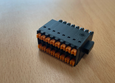

# 4.3.3.4. 设定设备


DIP 开关在出厂时设置为关闭模式，用户不应随意更改该设置。


表 4-10 设定伺服板 (BD641T) 的 DIP 开关 (DS1) 的方法

<table>
<thead>
  <tr>
    <th>开关编号</th>
    <th>1</th>
    <th>2</th>
    <th>模式</th>
  </tr>
</thead>
<tbody>
  <tr>
    <td>出厂时设置</td>
    <td>关闭</td>
    <td>关闭</td>
    <td>获取模式</td>
  </tr>
  <tr>
    <td>测试时</td>
    <td>打开</td>
    <td>关闭</td>
    <td>等待模式</td>
  </tr>
  <tr>
    <td>开关外观</td>
    <td colspan="3"></td>
  </tr>
</tbody>
</table>

  


用户不能随意更改以下项目，并且仅在需要通过 FPGA JTAG 重新编程时参考它们。


表 4-11 伺服板 (BD641T) 的跳线 (JP1) 描述

<table>
<thead>
  <tr>
    <th colspan="2" rowspan="2">名称 设置内容</th>
    <th colspan="4">JP1</th>
</tr>
  <tr>
    <th>1</th>
    <th>2</th>
    <th>3</th>
    <th></th>
  </tr>
</thead>
<tbody>
  <tr>
    <td rowspan="2">跳线设置</td>
    <td>QSPI（闪存）引导模式</td>
    <td>⊙</td>
    <td>⊙</td>
    <td></td>
    <td></td>
  </tr>
  <tr>
    <td>JTAG编程模式</td>
    <td></td>
    <td>⊙</td>
    <td>⊙</td>
    <td></td>
  </tr>
  <tr>
    <td>出厂时的设置</td>
    <td colspan="5">跳线1~2，或无连接</td>
  </tr>
</tbody>
</table>
  

(1) BD641T输送接口：TBCV

图4.17 BD641T（伺服控制板）TBCV


在通过连接与输送相关的输入进行激活时，请参考“1.11 操作机器人时的安全措施”检查功能是否正常工作。


表4-12 BD641T（伺服控制板）TBCV描述

<table>
<thead>
  <tr>
    <th>端子号</th>
    <th>端子名称</th>
<th>使用</th>
    <th>输入规格</th>
  </tr>
</thead>
<tbody>
  <tr>
    <td>11</td>
    <td>PA1+</td>
    <td rowspan="2">通道 1
    
线路驱动方法

    
输送机相 A 脉冲输入
</td>
    <td rowspan="2">0 ~ 5V, 100kHz 或更低</td>
  </tr>
  <tr>
    <td>12</td>
    <td>PA1-</td>
  </tr>
  <tr>
    <td>13</td>
    <td>PB1+</td>
    <td rowspan="2">通道 1
    
线路驱动方法

    
输送机相 B 脉冲输入
</td>
    <td rowspan="2">0 ~ 5V, 100kHz 或更低</td>
  </tr>
  <tr>
    <td>14</td>
    <td>PB1-</td>
  </tr>
  <tr>
    <td>15</td>
    <td>LD_LS1</td>
    <td rowspan="2">通道 1
    
线路驱动方法

    
用于检测工件的限位开关输入
</td>
    <td rowspan="2">0 ~ -30V</td>
  </tr>
  <tr>
    </tr>
  <tr>
    <td>16</td>
    <td>GND_LS1</td>
    <td rowspan="2">通道 1
    
线路驱动方法

    
电源 GND 输入
</td>
    <td rowspan="2">0V</td>
  </tr>
  <tr>
  </tr>
  <tr>
<td>17</td>
    <td>P1+</td>
    <td rowspan="2">通道 1
    
开集电极方法 

    
电源输入
</td>
    <td rowspan="2">0 ~ -30V, 100kHz 或更低</td>
  </tr>
  <tr>
  </tr>
   <tr>
    <td>18</td>
    <td>A1</td>
    <td rowspan="2">通道 1
    
开集电极方法 

    
输送机相 A 脉冲输入
</td>
    <td rowspan="2">0 ~ -30V, 100kHz 或更低</td>
  </tr>
  <tr>
    </tr>
  <tr>
    <td>19</td>
    <td>B1</td>
    <td rowspan="2">通道 1
    
开集电极方法 

    
输送机相 B 脉冲输入
</td>
    <td rowspan="2">0 ~ -30V, 100kHz 或更低</td>
  </tr>
  <tr>
  </tr>
  <tr>
    <td>20</td>
    <td>OC_LS1</td>
    <td rowspan="2">通道 1
    
开集电极方法 

    
用于检测工件的限位开关输入
</td>
    <td rowspan="2">0 ~ -30V</td>
  </tr>
  <tr>
  </tr>
  <tr>
    <td>1</td>
    <td>PA2+</td>
    <td rowspan="2">通道 2
    
线路驱动方法

    
输送机相 A 脉冲输入
</td>
    <td rowspan="2">0 ~ 5V, 100kHz 或更低</td>
  </tr>
  <tr>
    <td>2</td>
    <td>PA2-</td>
</tr>
  <tr>
    <td>3</td>
    <td>PB2+</td>
    <td rowspan="2">通道 2
    
线路驱动方法

    
输送机相 B 脉冲输入
</td>
    <td rowspan="2">0 ~ 5V，100kHz 或更低</td>
  </tr>
  <tr>
    <td>4</td>
    <td>PB2-</td>
  </tr>
  <tr>
    <td>5</td>
    <td>LD_LS2</td>
    <td rowspan="2">通道 2
    
线路驱动方法

    
用于检测工件的限位开关输入
</td>
    <td rowspan="2">0 ~ -30V</td>
  </tr>
  <tr>
    </tr>
  <tr>
    <td>6</td>
    <td>GND_LS2</td>
    <td rowspan="2">通道 2
    
线路驱动方法

    
电源地输入
</td>
    <td rowspan="2">0V</td>
  </tr>
  <tr>
  </tr>
  <tr>
    <td>7</td>
    <td>P2+</td>
    <td rowspan="2">通道 2
    
开集电极方法 

    
电源输入
</td>
    <td rowspan="2">0 ~ -30V，100kHz 或更低</td>
  </tr>
  <tr>
  </tr>
   <tr>
    <td>8</td>
    <td>A2</td>
    <td rowspan="2">通道 2
    
开集电极方法 

    
输送机相 A 脉冲输入
</td>
    <td rowspan="2">0 ~ -30V，100kHz 或更低</td>
</tr>
  <tr>
    </tr>
  <tr>
    <td>9</td>
    <td>B2</td>
    <td rowspan="2">通道 2
    
开放集电极方法 

    
输送机相 B 脉冲输入
</td>
    <td rowspan="2">0 ~ -30V，100kHz 或更低</td>
  </tr>
  <tr>
  </tr>
  <tr>
    <td>10</td>
    <td>OC_LS2</td>
    <td rowspan="2">通道 2
    
开放集电极方法 

    
用于检测工件的限位开关输入
</td>
    <td rowspan="2">0 ~ -30V</td>
  </tr>
  <tr>
  </tr>
</tbody>
</table>
  

(2) 用于连接 BD641T I/O 的端子块
  

图 4.18 BD641T（伺服控制板）TBIO


通过连接 I/O 相关的输入或输出进行激活时，请参考“1.11 机器人操作时的安全措施”检查功能是否正常工作。


表 4-13 BD641T（伺服控制板）TBIO 的描述
<table>
<thead>
  <tr>
    <th>端子号</th>
    <th>端子名称</th>
    <th>用途</th>
    <th>I/O 规格</th>
  </tr>
</thead>
<tbody>
  <tr>
  </tr>
<tr>
    <td>11</td>
    <td>DIN1</td>
    <td rowspan="2">数字输入 - 1</td>
    <td rowspan="2">0 ~ 24V</td>
  </tr>
  <tr>
  </tr>
   <tr>
    <td>12</td>
    <td>DIN2</td>
    <td rowspan="2">数字输入 - 2</td>
    <td rowspan="2">0 ~ 24V</td>
  </tr>
  <tr>
    </tr>
  <tr>
    <td>13</td>
    <td>DIN3</td>
    <td rowspan="2">数字输入 - 3</td>
    <td rowspan="2">0 ~ 24V</td>
  </tr>
  <tr>
  </tr>
  <tr>
    <td>14</td>
    <td>DIN4</td>
    <td rowspan="2">数字输入 - 4</td>
    <td rowspan="2">0 ~ 24V</td>
  </tr>
  <tr>
  </tr>
    <tr>
  </tr>
  <tr>
    <td>15</td>
    <td>DIN5</td>
    <td rowspan="2">数字输入 - 5</td>
    <td rowspan="2">0 ~ 24V</td>
  </tr>
  <tr>
  </tr>
   <tr>
    <td>16</td>
    <td>DIN6</td>
    <td rowspan="2">数字输入 - 6</td>
    <td rowspan="2">0 ~ 24V</td>
  </tr>
  <tr>
    </tr>
<tr>
    <td>17</td>
    <td>DIN7</td>
    <td rowspan="2">数字输入 - 7</td>
    <td rowspan="2">0 ~ 24V</td>
  </tr>
  <tr>
  </tr>
  <tr>
    <td>18</td>
    <td>DIN8</td>
    <td rowspan="2">数字输入 - 8</td>
    <td rowspan="2">0 ~ 24V</td>
  </tr>
  <tr>
  </tr>
    <tr>
  </tr>
  <tr>
    <td>19</td>
    <td>DIN1</td>
    <td rowspan="2">数字输入电源 COM</td>
    <td rowspan="2">0 ~ 24V</td>
  </tr>
  <td>20</td>
  <td>DIN2</td>
  <tr>
  </tr>
    <tr>
    </tr>
  <tr>
    <td>1</td>
    <td>DOUT1</td>
    <td rowspan="2">数字输出 - 1</td>
    <td rowspan="2">0 ~ 24V</td>
  </tr>
  <tr>
  </tr>
  <tr>
    <td>2</td>
    <td>DOUT2</td>
    <td rowspan="2">数字输出 - 2</td>
    <td rowspan="2">0 ~ 24V</td>
  </tr>
  <tr>
  </tr>
    <tr>
  </tr>
  <tr>
    <td>3</td>
<td>DOUT3</td>
    <td rowspan="2">数字输出 - 3</td>
    <td rowspan="2">0 ~ 24V</td>
  </tr>
  <tr>
  </tr>
   <tr>
    <td>4</td>
    <td>DOUT4</td>
    <td rowspan="2">数字输出 - 4</td>
    <td rowspan="2">0 ~ 24V</td>
  </tr>
  <tr>
    </tr>
  <tr>
    <td>5</td>
    <td>DOUT5</td>
    <td rowspan="2">数字输出 - 5</td>
    <td rowspan="2">0 ~ 24V</td>
  </tr>
  <tr>
  </tr>
  <tr>
    <td>6</td>
    <td>DOUT6</td>
    <td rowspan="2">数字输出 - 6</td>
    <td rowspan="2">0 ~ 24V</td>
  </tr>
  <tr>
  </tr>
    <tr>
  </tr>
  <tr>
    <td>7</td>
    <td>DOUT7</td>
    <td rowspan="2">数字输出 - 7</td>
    <td rowspan="2">0 ~ 24V</td>
  </tr>
  <tr>
  </tr>
   <tr>
    <td>8</td>
    <td>DOUT8</td>
    <td rowspan="2">数字输出 - 8</td>
    <td rowspan="2">0 ~ 24V</td>
  </tr>
  <tr>
    </tr>
  <tr>
    <td>9</td>
<td>DOCOM1</td>
    <td rowspan="2">数字输出电源 COM</td>
    <td rowspan="2">0 ~ 24V</td>
  </tr>
  <td>10</td>
  <td>DOCOM1</td>
  <tr>
  </tr>
</tbody>
</table>