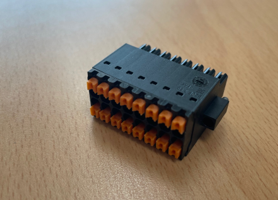

# 4.3.3.4. 설정장치


DIP스위치는 출고 시 모드 OFF로 설정되어 있으며, 사용자가 임의로 변경하면 안됩니다.


표 4-10 서보제어보드(BD641T) DIP스위치(DS1) 설정방법

<table>
<thead>
  <tr>
    <th>스위치 번호</th>
    <th>1</th>
    <th>2</th>
    <th>모드</th>
  </tr>
</thead>
<tbody>
  <tr>
    <td>출고 시 설정</td>
    <td>OFF</td>
    <td>OFF</td>
    <td>GET MODE</td>
  </tr>
  <tr>
    <td>테스트 시</td>
    <td>ON</td>
    <td>OFF</td>
    <td>WAIT MODE</td>
  </tr>
  <tr>
    <td>스위치 외형</td>
    <td colspan="3"></td>
  </tr>
</tbody>
</table>


다음은 사용자가 임의로 변경할 수 없으며, FPGA JTAG을 통한 재프로그래밍이 필요한 경우에만 참고하세요.


표 4-11 서보제어보드(BD641T) 점퍼 (JP1) 설명

<table>
<thead>
  <tr>
    <th colspan="2" rowspan="2">명칭 설정내용</th>
    <th colspan="4">JP1</th>
  </tr>
  <tr>
    <th>1</th>
    <th>2</th>
    <th>3</th>
    <th></th>
  </tr>
</thead>
<tbody>
  <tr>
    <td rowspan="2">점퍼 셋팅</td>
    <td>QSPI (플래쉬) 부팅 모드</td>
    <td>⊙</td>
    <td>⊙</td>
    <td></td>
    <td></td>
  </tr>
  <tr>
    <td>JTAG 프로그래밍 모드</td>
    <td></td>
    <td>⊙</td>
    <td>⊙</td>
    <td></td>
  </tr>
  <tr>
    <td>출고 시 설정</td>
    <td colspan="5">1-2 점퍼 또는 연결 없음</td>
  </tr>
</tbody>
</table>
  

(1)	BD641T Conveyer Interface : TBCV
  

그림 4.17 BD641T(Servo Control Board) TBCV


컨베이어 관련 입력을 연결하여 활성화를 한경우 반드시 “1.11. 로봇 조작시 안전대책”을 참고하여 기능 정상 동작 여부를 확인하여 주십시오.


표 4-12 BD641T(Servo Control Board) TBCV 설명

<table>
<thead>
  <tr>
    <th>단자번호</th>
    <th>단자명</th>
    <th>용도</th>
    <th>입력 사양</th>
  </tr>
</thead>
<tbody>
  <tr>
    <td>11</td>
    <td>PA1+</td>
    <td rowspan="2">채널1
    
라인드라이브방식

    
컨베이어 A상 펄스 입력
</td>
    <td rowspan="2">0 ~ 5V, 100kHz 이하</td>
  </tr>
  <tr>
    <td>12</td>
    <td>PA1-</td>
  </tr>
  <tr>
    <td>13</td>
    <td>PB1+</td>
    <td rowspan="2">채널1
    
라인드라이브방식

    
컨베이어 B상 펄스 입력
</td>
    <td rowspan="2">0 ~ 5V, 100kHz 이하</td>
  </tr>
  <tr>
    <td>14</td>
    <td>PB1-</td>
  </tr>
  <tr>
    <td>15</td>
    <td>LD_LS1</td>
    <td rowspan="2">채널1
    
라인드라이브방식

    
작업물 검출용 리밋스위치 입력
</td>
    <td rowspan="2">0 ~ -30V</td>
  </tr>
  <tr>
    </tr>
  <tr>
    <td>16</td>
    <td>GND_LS1</td>
    <td rowspan="2">채널1
    
라인드라이브방식

    
전원 GND 입력
</td>
    <td rowspan="2">0V</td>
  </tr>
  <tr>
  </tr>
  <tr>
    <td>17</td>
    <td>P1+</td>
    <td rowspan="2">채널1
    
오픈컬랙터 방식 

    
전원 입력
</td>
    <td rowspan="2">0 ~ -30V, 100kHz 이하</td>
  </tr>
  <tr>
  </tr>
   <tr>
    <td>18</td>
    <td>A1</td>
    <td rowspan="2">채널1
    
오픈컬랙터 방식 

    
컨베이어 A상 펄스 입력
</td>
    <td rowspan="2">0 ~ -30V, 100kHz 이하</td>
  </tr>
  <tr>
    </tr>
  <tr>
    <td>19</td>
    <td>B1</td>
    <td rowspan="2">채널1
    
오픈컬랙터 방식 

    
컨베이어 B상 펄스 입력
</td>
    <td rowspan="2">0 ~ -30V, 100kHz 이하</td>
  </tr>
  <tr>
  </tr>
  <tr>
    <td>20</td>
    <td>OC_LS1</td>
    <td rowspan="2">채널1
    
오픈컬랙터 방식 

    
작업물 검출용 리밋스위치 입력
</td>
    <td rowspan="2">0 ~ -30V</td>
  </tr>
  <tr>
  </tr>
  <tr>
    <td>1</td>
    <td>PA2+</td>
    <td rowspan="2">채널2
    
라인드라이브방식

    
컨베이어 A상 펄스 입력
</td>
    <td rowspan="2">0 ~ 5V, 100kHz 이하</td>
  </tr>
  <tr>
    <td>2</td>
    <td>PA2-</td>
  </tr>
  <tr>
    <td>3</td>
    <td>PB2+</td>
    <td rowspan="2">채널2
    
라인드라이브방식

    
컨베이어 B상 펄스 입력
</td>
    <td rowspan="2">0 ~ 5V, 100kHz 이하</td>
  </tr>
  <tr>
    <td>4</td>
    <td>PB2-</td>
  </tr>
  <tr>
    <td>5</td>
    <td>LD_LS2</td>
    <td rowspan="2">채널2
    
라인드라이브방식

    
작업물 검출용 리밋스위치 입력
</td>
    <td rowspan="2">0 ~ -30V</td>
  </tr>
  <tr>
    </tr>
  <tr>
    <td>6</td>
    <td>GND_LS2</td>
    <td rowspan="2">채널2
    
라인드라이브방식

    
전원 GND 입력
</td>
    <td rowspan="2">0V</td>
  </tr>
  <tr>
  </tr>
  <tr>
    <td>7</td>
    <td>P2+</td>
    <td rowspan="2">채널2
    
오픈컬랙터 방식 

    
전원 입력
</td>
    <td rowspan="2">0 ~ -30V, 100kHz 이하</td>
  </tr>
  <tr>
  </tr>
   <tr>
    <td>8</td>
    <td>A2</td>
    <td rowspan="2">채널2
    
오픈컬랙터 방식 

    
컨베이어 A상 펄스 입력
</td>
    <td rowspan="2">0 ~ -30V, 100kHz 이하</td>
  </tr>
  <tr>
    </tr>
  <tr>
    <td>9</td>
    <td>B2</td>
    <td rowspan="2">채널2
    
오픈컬랙터 방식 

    
컨베이어 B상 펄스 입력
</td>
    <td rowspan="2">0 ~ -30V, 100kHz 이하</td>
  </tr>
  <tr>
  </tr>
  <tr>
    <td>10</td>
    <td>OC_LS2</td>
    <td rowspan="2">채널2
    
오픈컬랙터 방식 

    
작업물 검출용 리밋스위치 입력
</td>
    <td rowspan="2">0 ~ -30V</td>
  </tr>
  <tr>
  </tr>
</tbody>
</table>
  

(2) BD641T I/O 연결용 터미널블럭: TBIO
  

그림 4.18 BD641T(Servo Control Board) TBIO


I/O 관련 입출력을 연결하여 활성화를 한경우 반드시 “1.11.1 로봇 조작시 안전대책”을 참고하여 기능 정상 동작 여부를 확인하여 주십시오.


표 4-13 BD641T(Servo Control Board) TBIO 설명
<table>
<thead>
  <tr>
    <th>단자번호</th>
    <th>단자명</th>
    <th>용도</th>
    <th>입출력 사양</th>
  </tr>
</thead>
<tbody>
  <tr>
  </tr>
  <tr>
    <td>11</td>
    <td>DIN1</td>
    <td rowspan="2">Digital Input - 1</td>
    <td rowspan="2">0 ~ 24V</td>
  </tr>
  <tr>
  </tr>
   <tr>
    <td>12</td>
    <td>DIN2</td>
    <td rowspan="2">Digital Input - 2</td>
    <td rowspan="2">0 ~ 24V</td>
  </tr>
  <tr>
    </tr>
  <tr>
    <td>13</td>
    <td>DIN3</td>
    <td rowspan="2">Digital Input - 3</td>
    <td rowspan="2">0 ~ 24V</td>
  </tr>
  <tr>
  </tr>
  <tr>
    <td>14</td>
    <td>DIN4</td>
    <td rowspan="2">Digital Input - 4</td>
    <td rowspan="2">0 ~ 24V</td>
  </tr>
  <tr>
  </tr>
    <tr>
  </tr>
  <tr>
    <td>15</td>
    <td>DIN5</td>
    <td rowspan="2">Digital Input - 5</td>
    <td rowspan="2">0 ~ 24V</td>
  </tr>
  <tr>
  </tr>
   <tr>
    <td>16</td>
    <td>DIN6</td>
    <td rowspan="2">Digital Input - 6</td>
    <td rowspan="2">0 ~ 24V</td>
  </tr>
  <tr>
    </tr>
  <tr>
    <td>17</td>
    <td>DIN7</td>
    <td rowspan="2">Digital Input - 7</td>
    <td rowspan="2">0 ~ 24V</td>
  </tr>
  <tr>
  </tr>
  <tr>
    <td>18</td>
    <td>DIN8</td>
    <td rowspan="2">Digital Input - 8</td>
    <td rowspan="2">0 ~ 24V</td>
  </tr>
  <tr>
  </tr>
    <tr>
  </tr>
  <tr>
    <td>19</td>
    <td>DIN1</td>
    <td rowspan="2">Digital Input 전원 COM</td>
    <td rowspan="2">0 ~ 24V</td>
  </tr>
  <td>20</td>
  <td>DIN2</td>
  <tr>
  </tr>
    <tr>
    </tr>
  <tr>
    <td>1</td>
    <td>DOUT1</td>
    <td rowspan="2">Digital Input - 1</td>
    <td rowspan="2">0 ~ 24V</td>
  </tr>
  <tr>
  </tr>
  <tr>
    <td>2</td>
    <td>DOUT2</td>
    <td rowspan="2">Digital Input - 2</td>
    <td rowspan="2">0 ~ 24V</td>
  </tr>
  <tr>
  </tr>
    <tr>
  </tr>
  <tr>
    <td>3</td>
    <td>DOUT3</td>
    <td rowspan="2">Digital Input - 3</td>
    <td rowspan="2">0 ~ 24V</td>
  </tr>
  <tr>
  </tr>
   <tr>
    <td>4</td>
    <td>DOUT4</td>
    <td rowspan="2">Digital Input - 4</td>
    <td rowspan="2">0 ~ 24V</td>
  </tr>
  <tr>
    </tr>
  <tr>
    <td>5</td>
    <td>DOUT5</td>
    <td rowspan="2">Digital Input - 5</td>
    <td rowspan="2">0 ~ 24V</td>
  </tr>
  <tr>
  </tr>
  <tr>
    <td>6</td>
    <td>DOUT6</td>
    <td rowspan="2">Digital Input - 6</td>
    <td rowspan="2">0 ~ 24V</td>
  </tr>
  <tr>
  </tr>
    <tr>
  </tr>
  <tr>
    <td>7</td>
    <td>DOUT7</td>
    <td rowspan="2">Digital Input - 7</td>
    <td rowspan="2">0 ~ 24V</td>
  </tr>
  <tr>
  </tr>
   <tr>
    <td>8</td>
    <td>DOUT8</td>
    <td rowspan="2">Digital Input - 8</td>
    <td rowspan="2">0 ~ 24V</td>
  </tr>
  <tr>
    </tr>
  <tr>
    <td>9</td>
    <td>DOCOM1</td>
    <td rowspan="2">Digital Output 전원 COM</td>
    <td rowspan="2">0 ~ 24V</td>
  </tr>
  <td>10</td>
  <td>DOCOM1</td>
  <tr>
  </tr>
</tbody>
</table>