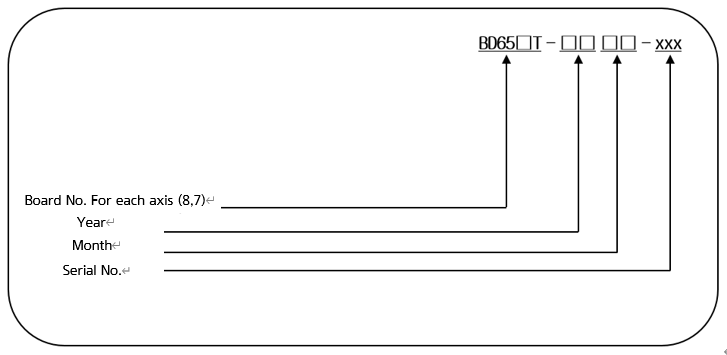

# 4.3.4.1. BD658T/BD657T (放大板)

放大板执行功率放大的功能，使得电流可以根据来自伺服板的电流命令流向电动机的各个相位。BD658T和BD657T能够同时驱动6个电动机，配置如下。

从电源模块提供的单相电流经过二极管模块整流后，转化为直流并储存在平滑电容器中。

  

表 4-14 BD658T / BD657T 的配置 (放大板)

<table>
<thead>
  <tr>
    <th colspan="2">组件</th>
    <th>功能</th>
  </tr>
</thead>
<tbody>
  <tr>
    <td rowspan="6">BD658T/657T (放大板)</td>
    <td>门驱动电路</td>
    <td>生成IPM门信号</td>
  </tr>
  <tr>
    <td>门驱动电源模块</td>
    <td>生成门驱动电源</td>
  </tr>
  <tr>
    <td>电流检测部分</td>
    <td>检测流过电动机的电流</td>
  </tr>
  <tr></tr>
  <tr></tr>
  <tr></tr>
  <tr>
    <td rowspan="4">其他部分</td>
    <td>散热器</td>
    <td>将功率元件产生的热量释放到外部</td>
  </tr>
  <tr>
  <td>IPM</td>
  <td>一个开关设备</td>
  </tr>
</tbody>
</table>

  

■  **放大板型号的配置**

  

表4-15 放大板规格

<table>
<thead>
  <tr>
    <th>配置</th>
    <th colspan="2">分类</th>
    <th colspan="2">应用</th>
  </tr>
</thead>
<tbody>
  <tr>
    <td rowspan="2">板号
每个轴
</td>
    <td>8</td>
    <td>BD658T</td>
    <td>1~3轴</td>
    <td rowspan="2">6轴使用</td>
  </tr>
  <tr>
    <td>7</td>
    <td>BD657T</td>
    <td>4~6轴</td>
  </tr>
  <tr>
    <td>年份</td>
    <td colspan="2">00 ~ 99</td>
    <td colspan="2">生产年份：2000 ~ 2099</td>
  </tr>
  <tr>
    <td>月份</td>
    <td colspan="2">01 ~ 12</td>
    <td colspan="2">生产月份：一月~十二月</td>
  </tr>
  <tr>
    <td>序列号</td>
    <td colspan="2">0001 ~ 999</td>
    <td colspan="2">每月生产单位数：1~999</td>
  </tr>
</tbody>
</table>


放大板在背板上的固定位置可能不同，因此更换时必须检查类型。

  

图4.19 BD658T/657T 部件布局
  

表4-16 BD658T/657T 连接器描述

<table>
<tbody>
<tr class="odd">
<td>
<strong>名称</strong>
</td>
<td>
<strong>用途</strong>
</td>
<td>
<strong>外部设备连接</strong>
</td>
</tr>
<tr class="even">
<td>
<strong>CNM4~6</strong>
</td>
<td>
BD658T : 轴1到轴3的电机驱动输出

BD657T : 轴4到轴6的电机驱动输出
</td>
<td>
CMEC1
</td>
</tr>

</tbody>
</table>