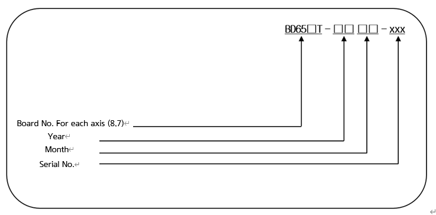
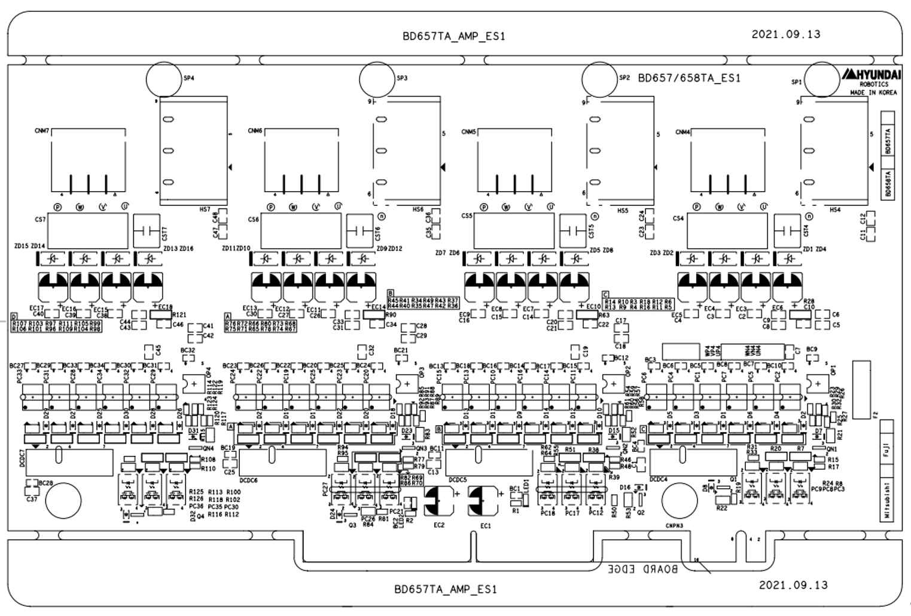

# 4.3.4.2. BD658TA/BD657TA (앰프 보드, 부가축 포함)

앰프 보드(AMP Board)은 서보보드로부터의 전류지령에 따라 모터 각 상에 전류를 흘려주는 전력증폭기능을 수행합니다. BD658TA와 BD657TA를 통해 8개의 모터를 동시에 구동시킬 수 있으며, 다음과 같이 구성되어 있습니다.

  

표 4-17 BD658TA / BD657TA (앰프 보드)의 구성

<table>
<thead>
  <tr>
    <th colspan="2">구성품</th>
    <th>기능</th>
  </tr>
</thead>
<tbody>
  <tr>
    <td rowspan="6">BD658TA/657TA (AMP Board)</td>
    <td>게이트 드라이브 회로</td>
    <td>IPM 게이트 신호 생성</td>
  </tr>
  <tr>
    <td>게이트 전원 모듈</td>
    <td>게이트 전원 생성</td>
  </tr>
  <tr>
    <td>전류 검출부</td>
    <td>모터에 흐르는 전류를 검출</td>
  </tr>
  <tr></tr>
  <tr></tr>
  <tr></tr>
  <tr>
    <td rowspan="4">기타부품</td>
    <td>방열판(Heat Sink)</td>
    <td>전력소자로부터 발생하는 열을 외부로 방출</td>
  </tr>
  <tr>
  <td>IPM</td>
  <td>스위칭 디바이스</td>
  </tr>
</tbody>
</table>

  

■  **앰프 보드 형번 구성**

  

표 4-18 앰프 보드의 사양

<table>
<thead>
  <tr>
    <th>구성</th>
    <th colspan="2">분류</th>
    <th colspan="2">적용</th>
  </tr>
</thead>
<tbody>
  <tr>
    <td rowspan="2">축별 보드 번호</td>
    <td>8</td>
    <td>BD658TA</td>
    <td>1~3번 축, 7번 축</td>
    <td rowspan="2">8축 사용</td>
  </tr>
  <tr>
    <td>7</td>
    <td>BD657TA</td>
    <td>4~6번 축, 8번 축</td>
  </tr>
  <tr>
    <td>년도</td>
    <td colspan="2">00 ~ 99</td>
    <td colspan="2">생산년도: 2000년 ~ 2099년</td>
  </tr>
  <tr>
    <td>월</td>
    <td colspan="2">01 ~ 12</td>
    <td colspan="2">생산월: 1월 ~ 12월</td>
  </tr>
  <tr>
    <td>일련번호</td>
    <td colspan="2">0001 ~ 999</td>
    <td colspan="2">월 생산대수: 1대 ~ 999대</td>
  </tr>
</tbody>
</table>


앰프보드는 백플레인보드에서 체결 위치가 다르므로 교환할 때 형식을 반드시 확인하시기 바랍니다.


그림 4.20 BD658TA/657TA 부품 배치도
  

표 4-19 BD658TA/657TA 커넥터 설명

<table>
<tbody>
<tr class="odd">
<td>
<strong>명칭</strong>
</td>
<td>
<strong>용도</strong>
</td>
<td>
<strong>외부장치접속</strong>
</td>
</tr>
<tr class="even">
<td>
<strong>CNM4~7</strong>
</td>
<td>
BD658TA : 1축~3축, 7축 모터 구동 출력

BD657TA : 4축~6축, 8축 모터 구동 출력
</td>
<td>
CMEC1
</td>
</tr>

</tbody>
</table>

