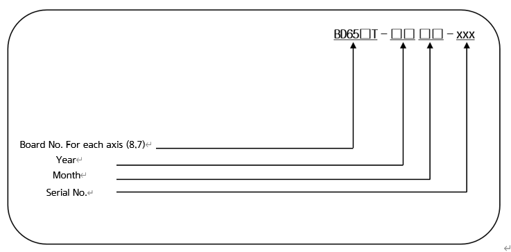
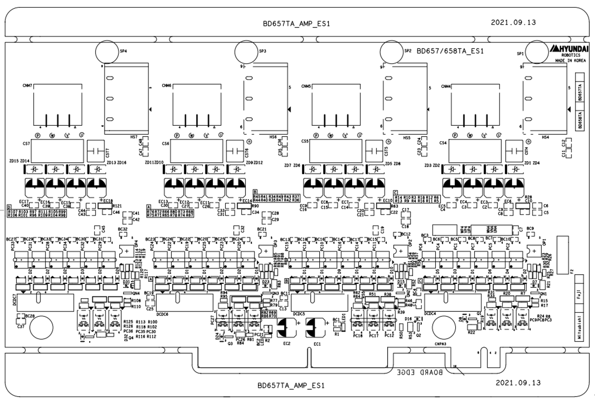

# 4.3.4.2. BD658TA/BD657TA (AMP板，包含附加轴)

AMP板执行功率放大功能，使电流根据来自伺服板的电流指令流向电机的各个相位。BD658TA和BD657TA能够同时驱动8台电机，其配置如下。

  

表4-17 BD658TA / BD657TA（AMP板）配置

<table>
<thead>
  <tr>
    <th colspan="2">组件</th>
    <th>功能</th>
  </tr>
</thead>
<tbody>
  <tr>
    <td rowspan="6">BD658TA/657TA (AMP板)</td>
    <td>门驱动电路</td>
    <td>生成IPM门信号</td>
  </tr>
  <tr>
    <td>门电源模块</td>
    <td>生成门电源</td>
  </tr>
  <tr>
    <td>电流检测部分</td>
    <td>检测流过电机的电流</td>
  </tr>
  <tr></tr>
  <tr></tr>
  <tr></tr>
  <tr>
    <td rowspan="4">其他部分</td>
    <td>散热器</td>
    <td>将功率元件产生的热量释放到外部</td>
  </tr>
  <tr>
  <td>IPM</td>
  <td>一种开关设备</td>
  </tr>
</tbody>
</table>

  

■  **AMP板类型编号的配置**

  
表 4-18 AMP 板的规格

<table>
<thead>
  <tr>
    <th>配置</th>
    <th colspan="2">分类</th>
    <th colspan="2">应用</th>
  </tr>
</thead>
<tbody>
  <tr>
    <td rowspan="2">每个轴的电路板编号
</td>
    <td>8</td>
    <td>BD658TA</td>
    <td>1~3 和 7 轴</td>
    <td rowspan="2">8 轴使用 </td>
  </tr>
  <tr>
    <td>7</td>
    <td>BD657TA</td>
    <td>4~6 和 8 轴</td>
  </tr>
  <tr>
    <td>年份</td>
    <td colspan="2">00 ~ 99</td>
    <td colspan="2">生产年份：2000-2099</td>
  </tr>
  <tr>
    <td>月份</td>
    <td colspan="2">01 ~ 12</td>
    <td colspan="2">生产月份：一月-十二月</td>
  </tr>
  <tr>
    <td>序列号</td>
    <td colspan="2">0001 ~ 999</td>
    <td colspan="2">每月生产单位数量：1~9999</td>
  </tr>
</tbody>
</table>


在背板上固定 amp 板的位置可能不同，因此更换时必须检查类型。


图 4.20 BD658TA/657TA 部件布局
Table 4-19 BD658TA/657TA 连接器描述

<table>
<tbody>
<tr class="odd">
<td>
<strong>名称</strong>
</td>
<td>
<strong>用途</strong>
</td>
<td>
<strong>外部设备的连接</strong>
</td>
</tr>
<tr class="even">
<td>
<strong>CNM4~7</strong>
</td>
<td>
BD658TA : 第 1 轴到第 4 轴及第 7 轴的电机驱动输出

BD657TA : 第 4 轴到第 6 轴及第 8 轴的电机驱动输出
</td>
<td>
CMEC1
</td>
</tr>

</tbody>
</table>