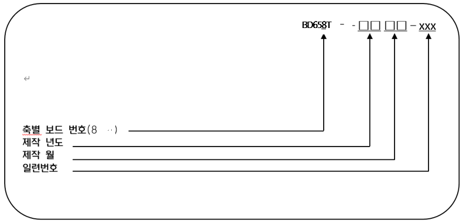
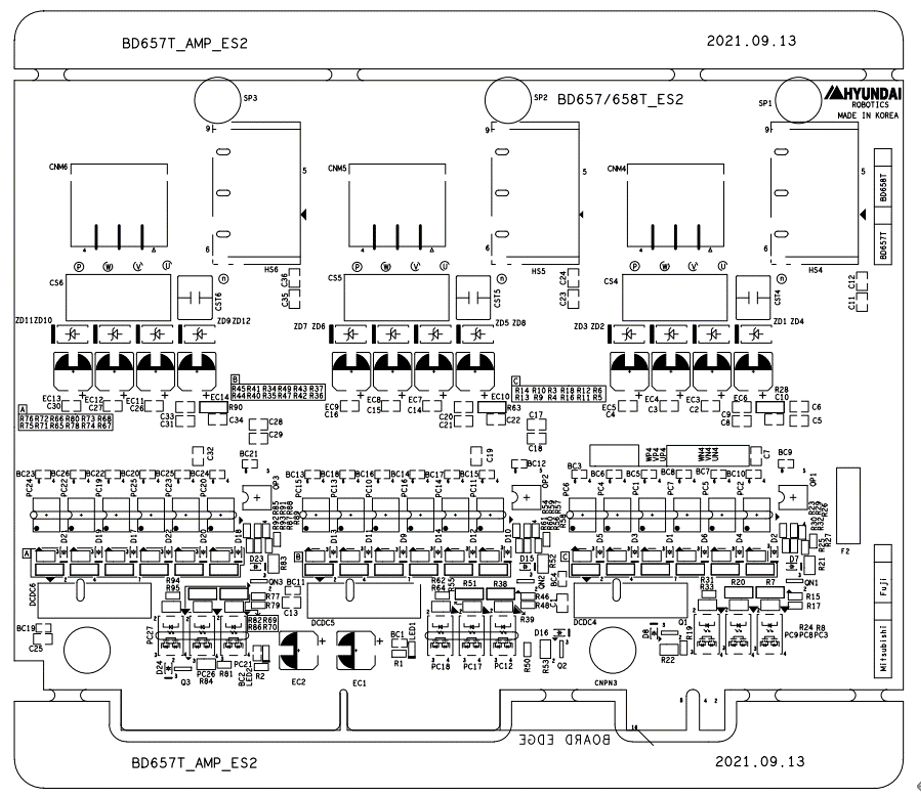

# 4.3.4.3. BD658T-S (AMP板, HH4E的主轴放大器)

AMP板执行功率放大功能，允许电流根据来自伺服板的电流命令流向电机的各个相。BD658TA和BD657TA能够同时驱动6台电机，配置如下。

  

表4-20 BD658T-S (AMP板) 的配置
<table>
<thead>
  <tr>
    <th colspan="2">组件</th>
    <th>功能</th>
  </tr>
</thead>
<tbody>
  <tr>
    <td rowspan="6">BD658T-S</td>
    <td>门驱动电路</td>
    <td>生成IPM门信号</td>
  </tr>
  <tr>
    <td>门电源模块</td>
    <td>生成门电源</td>
  </tr>
  <tr>
    <td>电流检测部分</td>
    <td>检测流经电机的电流</td>
  </tr>
  <tr></tr>
  <tr></tr>
  <tr></tr>
  <tr>
    <td rowspan="4">其他部件</td>
    <td>散热器</td>
    <td>将电力元件产生的热量释放到外部</td>
  </tr>
  <tr>
  <td>IPM</td>
  <td>一种开关设备</td>
  </tr>
</tbody>
</table>

  

■  **AMP板型号的配置**

  
Table 4-21 AMP板规格

<table>
<thead>
  <tr>
    <th>配置</th>
    <th colspan="2">分类</th>
    <th colspan="2">应用</th>
  </tr>
</thead>
<tbody>
  <tr>
    <td rowspan="2">每个轴的板号
</td>
    <td>8</td>
    <td>BD658T-S</td>
    <td>1~3 轴</td>
    <td rowspan="2">HH4的主要轴使用</td>
  </tr>
  <tr>
  </tr>
  <tr>
    <td>年份</td>
    <td colspan="2">00 ~ 99</td>
    <td colspan="2">年份</td>
  </tr>
  <tr>
    <td>月份</td>
    <td colspan="2">01 ~ 12</td>
    <td colspan="2">生产月份：一月-十二月</td>
  </tr>
  <tr>
    <td>0001 ~ 999</td>
    <td colspan="2">0001 ~ 999</td>
    <td colspan="2">每月生产单位数量：1~9999</td>
  </tr>
</tbody>
</table>


放置AMP板的位置可能在背板上有所不同，因此在更换时必须检查类型。


图4.21 BD658T-S组件布局图
  
Table 4-22 BD658T-S 连接器描述

<table>
<tbody>
<tr class="odd">
<td>
<strong>名称</strong>
</td>
<td>
<strong>用途</strong>
</td>
<td>
<strong>外部设备连接</strong>
</td>
</tr>
<tr class="even">
<td>
<strong>CNM4~6</strong>
</td>
<td>
BD658T : 轴 1 到 轴 3 的电机驱动输出

</td>
<td>
CMEC1
</td>
</tr>

</tbody>
</table>