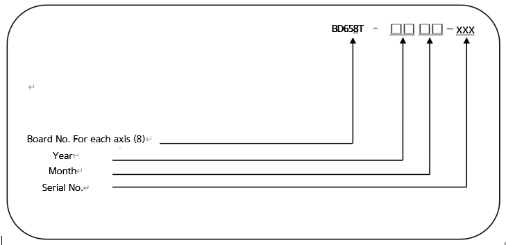

# 4.3.4.3. BD658T-S (AMP Board, Major axis amp for HH4E)

The AMP Board performs a power amplification function that allows the current to flow to individual phases of the motor according to the current command from the servo board. BD658TA and BD657TA enable simultaneous driving of 6 motors and are configured as follows.

  

Table 4-20 Configuration of BD658T-S (AMP Board)
<table>
<thead>
  <tr>
    <th colspan="2">Components</th>
    <th>Functions</th>
  </tr>
</thead>
<tbody>
  <tr>
    <td rowspan="6">BD658T-S</td>
    <td>Gate drive circuit</td>
    <td>Generates the IPM gate signal</td>
  </tr>
  <tr>
    <td>Gate power module</td>
    <td>Generates the gate power</td>
  </tr>
  <tr>
    <td>Current detection part</td>
    <td>Detects the current that flows through the motor</td>
  </tr>
  <tr></tr>
  <tr></tr>
  <tr></tr>
  <tr>
    <td rowspan="4">Other Parts</td>
    <td>Heat sink</td>
    <td>Releases the heat generated from power elements to the outside</td>
  </tr>
  <tr>
  <td>IPM</td>
  <td>A switching device</td>
  </tr>
</tbody>
</table>

  

■  **Configuration of the Type Number of AMP Board**

  

Table 4-21 Specification of the AMP Board

<table>
<thead>
  <tr>
    <th>Configuration</th>
    <th colspan="2">Classification</th>
    <th colspan="2">Application</th>
  </tr>
</thead>
<tbody>
  <tr>
    <td rowspan="2">Board No. For each axis
</td>
    <td>8</td>
    <td>BD658T-S</td>
    <td>1~3 axes</td>
    <td rowspan="2">Major axis use for HH4</td>
  </tr>
  <tr>
  </tr>
  <tr>
    <td>Year</td>
    <td colspan="2">00 ~ 99</td>
    <td colspan="2">Year</td>
  </tr>
  <tr>
    <td>Month</td>
    <td colspan="2">01 ~ 12</td>
    <td colspan="2">Production month: January-December</td>
  </tr>
  <tr>
    <td>0001 ~ 999</td>
    <td colspan="2">0001 ~ 999</td>
    <td colspan="2">Number of units produced monthly: 1~9999</td>
  </tr>
</tbody>
</table>


The location where the amp board is fastened on the backplane board may be different, so you must check the type when replacing it.


Figure 4.21 BD658T-S 부품 배치도
  

Table 4-22 BD658T-S connector description

<table>
<tbody>
<tr class="odd">
<td>
<strong>Name</strong>
</td>
<td>
<strong>Usage</strong>
</td>
<td>
<strong>Connection of external devices</strong>
</td>
</tr>
<tr class="even">
<td>
<strong>CNM4~6</strong>
</td>
<td>
BD658T : Motor drive output for Axis 1 to Axis 3

</td>
<td>
CMEC1
</td>
</tr>

</tbody>
</table>

