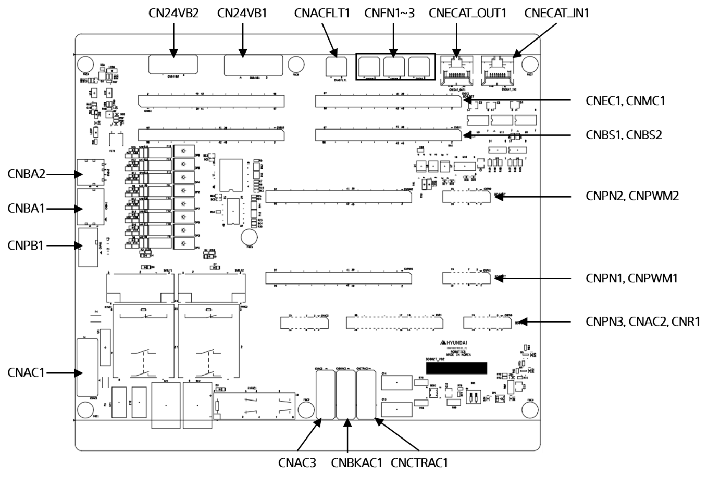

# 4.3.5.2. 连接器

连接器在背板电路板 (BD602T) 上的放置如下图所示，每个连接器的使用和访问设备如表4-23所示。

图4.22 背板电路板 (BD602T) 的连接器
  

表4-23 BD602T 连接器的类型和用法 

<table>
<tbody>
<tr class="odd">
<td>
<strong>名称</strong>
</td>
<td>
<strong>用法</strong>
</td>
<td>
<strong>规格</strong>
</td>
</tr>
<tr class="even">
<td>
<strong>CN24VB1</strong>
</td>
<td>
控制电源输入
</td>
<td>
24VDC
</td>
</tr>
<tr class="odd">
<td>
<strong>CNAC1</strong>
</td>
<td>
主电源输入
</td>
<td>
单相220V
</td>
</tr>
<tr class="even">
<td>
<strong>CNPB1</strong>
</td>
<td>
制动电源输入
</td>
<td>
24VDC
</td>
</tr>
<tr class="odd">
<td>
<strong>CNPA1</strong>
</td>
<td>
1~6轴制动信号输出
</td>
<td>
24VDC
</td>
</tr>
<tr class="even">
<td>
<strong>CNPA2</strong>
</td>
<td>
7, 8轴制动信号输出
</td>
<td>
三相220V, MC2 输出端
</td>
</tr>
<tr class="odd">
<td>
<strong>CNAC3</strong>
</td>
<td>
SMPS 电源输入
</td>
<td>
单相220V
</td>
</tr>
<tr class="even">
<td>
<strong>CNBKAC1</strong>
</td>
<td>
SMPS动刹车电源输出
</td>
<td>
单相220V
</td>
</tr>
<tr class="odd">
<td>
<strong>CNCTRAC1</strong>
</td>
<td>
SMPS控制电源输出
</td>
<td>
单相220V
</td>
</tr>
<tr class="even">
<td>
<strong>CN24VB2</strong>
</td>
<td>
H6ComT电源输入
</td>
<td>
24VDC
</td>
</tr>
<tr class="odd">
<td>
<strong>CNECAT_IN1</strong>
</td>
<td>
EtherCAT通信输入
</td>
<td>
-
</td>
</tr>
<tr class="even">
<td>
<strong>CNECAT_OUT1</strong>
</td>
<td>
EtherCAT通信输出
</td>

</td>
<td>
-
</td>
</tr>
<tr class="odd">
<td>
<strong>CNFN1~3</strong>
</td>
<td>
风扇电源输出
</td>
<td>
24VDC
</td>
</tr>
<tr class="even">
<td>
<strong>CNACFLT1</strong>
</td>
<td>
电源故障检测信号输出
</td>
<td>
H6ComT DIO
</td>
</tr>
<tr class="odd">
<td>
<strong>CNEC1, CNMC1</strong>
</td>
<td>
BD632T连接器
</td>
<td>
-
</td>
</tr>
<tr class="even">
<td>
<strong>CNBS1, CNBS2</strong>
</td>
<td>
BD641T连接器
</td>
<td>
-
</td>
</tr>
<tr class="odd">
<td>
<strong>CNPN2, CNPWM2</strong>
</td>
<td>
BD658T连接器
</td>
<td>
-
</td>
</tr>
<tr class="even">
<td>
<strong>CNPN1, CNPWM1</strong>
</td>
<td>
BD657T 连接连接器
</td>
<td>
-
</td>
</tr>
<tr class="odd">
<td>
<strong>CNPN3, CNAC2, CNR1</strong>
</td>
<td>
BD667T 连接连接器
</td>
<td>
-
</td>
</tr>
</tbody>
</table>