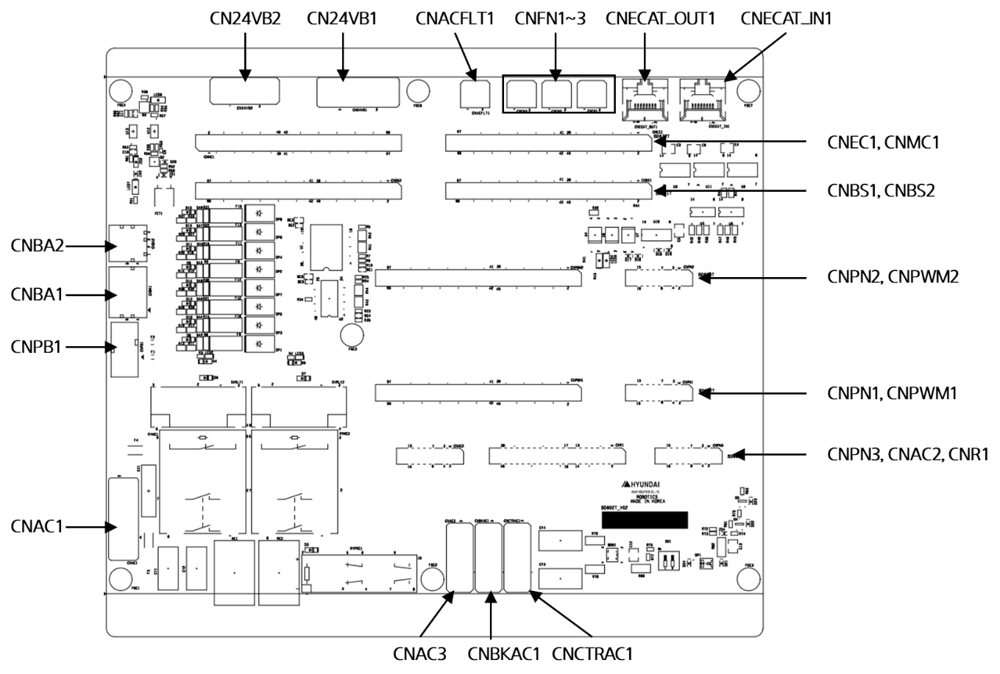

# 4.3.5.2. Connector

The placement of connectors on the backplane board (BD602T) is as shown in the following figure and the usage and access device for each is shown in Table 4-23.

그림 4.22 백플레인보드(BD602T)의 커넥터
  

표 4-23 BD602T 커넥터의 종류와 용도

<table>
<tbody>
<tr class="odd">
<td>
<strong>명칭</strong>
</td>
<td>
<strong>용도</strong>
</td>
<td>
<strong>사양</strong>
</td>
</tr>
<tr class="even">
<td>
<strong>CN24VB1</strong>
</td>
<td>
제어 전원 입력
</td>
<td>
24VDC
</td>
</tr>
<tr class="odd">
<td>
<strong>CNAC1</strong>
</td>
<td>
메인 전원 입력
</td>
<td>
단상 220V
</td>
</tr>
<tr class="even">
<td>
<strong>CNPB1</strong>
</td>
<td>
브레이크 전원 입력
</td>
<td>
24VDC
</td>
</tr>
<tr class="odd">
<td>
<strong>CNPA1</strong>
</td>
<td>
1~6축 브레이크 신호 출력
</td>
<td>
24VDC
</td>
</tr>
<tr class="even">
<td>
<strong>CNPA2</strong>
</td>
<td>
7, 8축 브레이크 신호 출력
</td>
<td>
3상 220V, MC2출력단
</td>
</tr>
<tr class="odd">
<td>
<strong>CNAC3</strong>
</td>
<td>
SMPS 전원 입력
</td>
<td>
단상 220V
</td>
</tr>
<tr class="even">
<td>
<strong>CNBKAC1</strong>
</td>
<td>
브레이크용 SMPS 전원 출력
</td>
<td>
단상 220V
</td>
</tr>
<tr class="odd">
<td>
<strong>CNCTRAC1</strong>
</td>
<td>
제어전원용 SMPS 전원 출력
</td>
<td>
단상 220V
</td>
</tr>
<tr class="even">
<td>
<strong>CN24VB2</strong>
</td>
<td>
H6ComT 전원 입력
</td>
<td>
24VDC
</td>
</tr>
<tr class="odd">
<td>
<strong>CNECAT_IN1</strong>
</td>
<td>
EhterCAT 통신 입력
</td>
<td>
-
</td>
</tr>
<tr class="even">
<td>
<strong>CNECAT_OUT1</strong>
</td>
<td>
EhterCAT 통신 출력
</td>
<td>
-
</td>
</tr>
<tr class="odd">
<td>
<strong>CNFN1~3</strong>
</td>
<td>
FAN 전원 출력
</td>
<td>
24VDC
</td>
</tr>
<tr class="even">
<td>
<strong>CNACFLT1</strong>
</td>
<td>
정전신호 검출 신호 출력
</td>
<td>
H6ComT DIO
</td>
</tr>
<tr class="odd">
<td>
<strong>CNEC1, CNMC1</strong>
</td>
<td>
BD632T 연결커넥터
</td>
<td>
-
</td>
</tr>
<tr class="even">
<td>
<strong>CNBS1, CNBS2</strong>
</td>
<td>
BD641T 연결커넥터
</td>
<td>
-
</td>
</tr>
<tr class="odd">
<td>
<strong>CNPN2, CNPWM2</strong>
</td>
<td>
BD658T 연결커넥터
</td>
<td>
-
</td>
</tr>
<tr class="even">
<td>
<strong>CNPN1, CNPWM1</strong>
</td>
<td>
BD657T 연결커넥터
</td>
<td>
-
</td>
</tr>
<tr class="odd">
<td>
<strong>CNPN3, CNAC2, CNR1</strong>
</td>
<td>
BD667T 연결커넥터
</td>
<td>
-
</td>
</tr>
</tbody>
</table>
