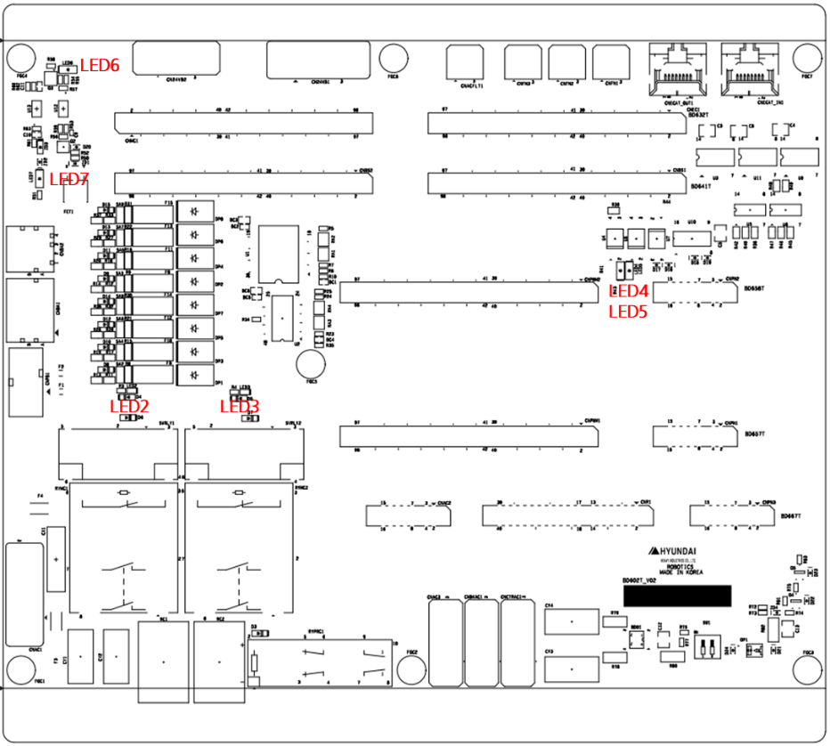

# 4.3.5.3. 표시장치

백플레인보드(BD602T)의 표시장치 배치는 다음 그림과 같으며 각각에 대한 용도는 표 4-24과 같습니다.

  

표 4-24 백플레인보드(BD602T) LED

<table>
<tbody>
<tr class="odd">
<td>
<strong>상태</strong>

<strong>명칭</strong>
</td>
<td>
<strong>표시내용</strong>
</td>
<td>
<strong>색상</strong>
</td>
<td>
<strong>정상시</strong>
</td>
<td>
<strong>이상발생시 조치내용</strong>
</td>
</tr>
<tr class="even">
<td>
<strong>LED2</strong>
</td>
<td>
RYMC1 접점상태
</td>
<td>
녹색
</td>
<td>
점등
</td>
<td>
-
</td>
</tr>
<tr class="odd">
<td>
<strong>LED3</strong>
</td>
<td>
RYMC2 접점상태
</td>
<td>
녹색
</td>
<td>
점등
</td>
<td>
-
</td>
</tr>
<tr class="even">
<td>
<strong>LED4</strong>
</td>
<td>
모터온 상태
</td>
<td>
녹색
</td>
<td>
점등
</td>
<td>
-
</td>
</tr>
<tr class="odd">
<td>
<strong>LED5</strong>
</td>
<td>
PWM 출력 상태
</td>
<td>
녹색
</td>
<td>
점등
</td>
<td>
-
</td>
</tr>
<tr class="even">
<td>
<strong>LED6</strong>
</td>
<td>
브레이크 ON 신호
</td>
<td>
녹색
</td>
<td>
점등
</td>
<td>
-
</td>
</tr>
<tr class="odd">
<td>
<strong>LED7</strong>
</td>
<td>
브레이크 전원
</td>
<td>
녹색
</td>
<td>
점등
</td>
<td>
현상 : 소등

조치1 : 입력전압 확인(24V)

조치2 : 소등 되었다면 퓨즈확인

조치3 : BD602T 교체
</td>
</tr>
</tbody>
</table>
