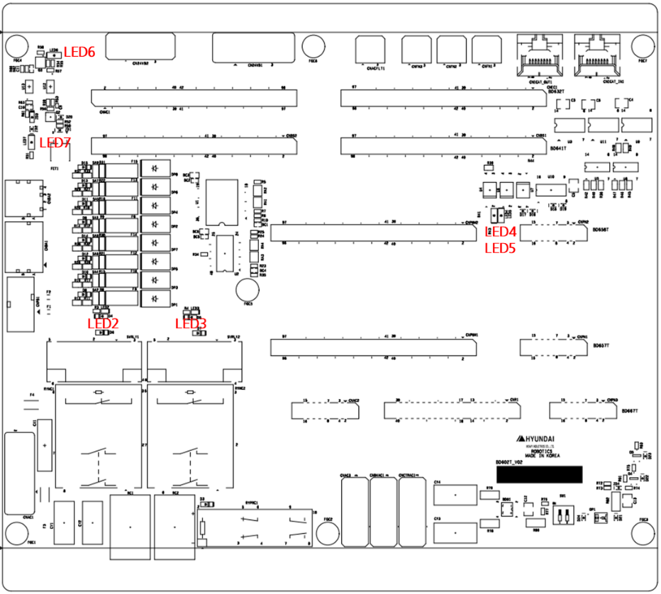

# 4.3.5.3. 显示设备

背板板（BD602T）的显示设备位置如以下图所示，每个用途如表4-24所示。

  

表4-24 背板板（BD602T）的LED

<table>
<tbody>
<tr class="odd">
<td>
<strong>状态</strong>

<strong>名称</strong>
</td>
<td>
<strong>显示内容</strong>
</td>
<td>
<strong>颜色</strong>
</td>
<td>
<strong>正常时</strong>
</td>
<td>
<strong>发生异常时采取的措施</strong>
</td>
</tr>
<tr class="even">
<td>
<strong>LED2</strong>
</td>
<td>
RYMC1接触状态
</td>
<td>
绿色
</td>
<td>
已打开
</td>
<td>
-
</td>
</tr>
<tr class="odd">
<td>
<strong>LED3</strong>
</td>
<td>
RYMC2接触状态
</td>
<td>
绿色
</td>
<td>
已打开
</td>
<td>
-
</td>
</tr>
<tr class="even">
<td>
<strong>LED4</strong>
</td>
<td>
电机开启状态
</td>
<td>
绿色
</td>
<td>
已打开
</td>
<td>
-
</td>
</tr>
<tr class="odd">
<td>
<strong>LED5</strong>
</td>
<td>
PWM输出状态
</td>
<td>
绿色
</td>
<td>
已打开
</td>
<td>
-
</td>
</tr>
<tr class="even">
<td>
<strong>LED6</strong>
</td>
<td>
刹车信号
</td>
<td>
绿色
</td>
<td>
已开启
</td>
<td>
-
</td>
</tr>
<tr class="odd">
<td>
<strong>LED7</strong>
</td>
<td>
 刹车电源
</td>
<td>
绿色
</td>
<td>
已开启
</td>
<td>
现象：已关闭 
操作 1：检查输入电压 (24V)。 
操作 2：如果已关闭，检查保险丝。 
操作 3：更换 BD602T。
</td>
</tr>
</tbody>
</table>