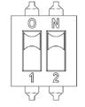

# 4.3.5.4. 设置设备


出厂时DIP开关设置为关闭状态，用户不应随意更改该设置。


表 4-25 设置背板板（BD602T）DIP开关（DS1）的方法 

<table>
<thead>
  <tr>
    <th>开关编号</th>
    <th>1</th>
    <th>2</th>
    <th>模式</th>
  </tr>
</thead>
<tbody>
  <tr>
    <td>出厂时的设置</td>
    <td>关闭(45%)</td>
    <td>关闭(3个周期)</td>
    <td>长模式</td>
  </tr>
  <tr>
    <td>测试时</td>
    <td>开启(70%)</td>
    <td>开启(1.5个周期)</td>
    <td>短模式</td>
  </tr>
  <tr>
    <td>开关外观</td>
    <td colspan="3"></td>
  </tr>
</tbody>
</table>

