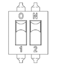

# 4.3.5.4. Setting Devices


The DIP switch is set to OFF mode when shipped from the factory, and the setting should not be changed arbitrarily by the user.


Table 4-25 Method to Set the DIP Switch (DS1) of the Backplane Board (BD602T) 

<table>
<thead>
  <tr>
    <th>Switch number</th>
    <th>1</th>
    <th>2</th>
    <th>Mode</th>
  </tr>
</thead>
<tbody>
  <tr>
    <td>Setting when shipped from the factory</td>
    <td>OFF(45%)</td>
    <td>OFF(3 cycles)</td>
    <td>Long MODE</td>
  </tr>
  <tr>
    <td>When testing</td>
    <td>ON(70%)</td>
    <td>ON(1.5 cycle)</td>
    <td>Short MODE</td>
  </tr>
  <tr>
    <td>Switch exterior</td>
    <td colspan="3"></td>
  </tr>
</tbody>
</table>

