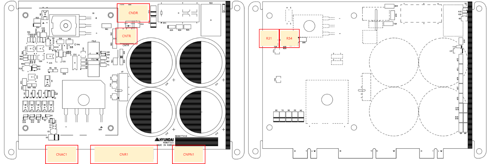

# 4.3.6.2. Connector

The following figure shows the locations and usage of various connectors on BD667T (PN regenerative discharge module).

Figure 4.23 Placement of Connectors of BD667T (PN Regenerative Discharge Module)
  

Table 4-26 Types and Usage of BD667T connectors (PN regenerative discharge module)

<table>
<tbody>
<tr class="odd">

<td>
<strong>Name</strong>
</td>
<td>
<strong>Usage</strong>
</td>
<td>
<strong>Connection of external devices</strong>
</td>
</tr>
<tr class="even">

<td>
<strong>CNDR</strong>
</td>
<td>
Discharge of regenerative discharge power
</td>
<td>
Regenerative discharge resistor
</td>
</tr>
<tr class="odd">

<td>
<strong>CNTR</strong>
</td>
<td>
Regenerative discharge resistor temperature measuring
</td>
<td>
Regenerative discharge resistor temperature sensor
</td>
</tr>
<tr class="even">

<td>
<strong>CNAC1</strong>
</td>
<td>
Connection for 15V power supply to digital devices, and connection for state signals
</td>
<td>
BD602
</td>
</tr>
<tr class="odd">

<td>
<strong>CNR1</strong>
</td>
<td>
220VAC power supply, and the motor drive power GND output.
</td>
<td>
BD602 -> AMP
</td>
</tr>
<tr class="even">

<td>
<strong>CNPN1</strong>
</td>
<td>
Motor drive power VDC output
</td>
<td>
BD602 -> AMP
</td>
</tr>
<tr class="odd">

<td>
<strong>R31</strong>
</td>
<td>
Overvoltage detection level setting (Default 5.7V)
</td>
<td>
-
</td>
</tr>
<tr class="even">

<td>
<strong>R54</strong>
</td>
<td>
Regenerative discharge operation detection level setting (Default 5.45V)

</td>
<td>
-
</td>
</tr>
<tr class="odd">

  </tr>
</tbody>
</table>

