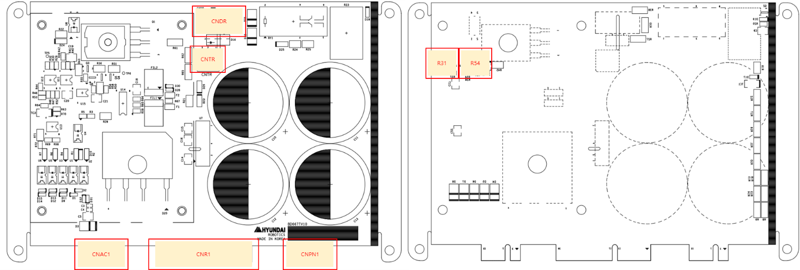

# 4.3.6.2. 连接器

下图显示了 BD667T (PN 再生放电模块) 上各种连接器的位置和使用方法。

图 4.23 BD667T (PN 再生放电模块) 连接器的放置
  

表 4-26 BD667T 连接器的类型和用途 (PN 再生放电模块)

<table>
<tbody>
<tr class="odd">

<td>
<strong>名称</strong>
</td>
<td>
<strong>用途</strong>
</td>
<td>
<strong>外部设备连接</strong>
</td>
</tr>
<tr class="even">

<td>
<strong>CNDR</strong>
</td>
<td>
再生放电功率的放电
</td>
<td>
再生放电电阻
</td>
</tr>
<tr class="odd">

<td>
<strong>CNTR</strong>
</td>
<td>
再生放电电阻温度测量
</td>
<td>
再生放电电阻温度传感器
</td>
</tr>
<tr class="even">

<td>
<strong>CNAC1</strong>
</td>
<td>
为数字设备提供 15V 电源和状态信号连接
</td>
<td>
BD602
</td>
</tr>
<tr class="odd">

<td>
<strong>CNR1</strong>
</td>
<td>
220VAC 电源和电机驱动电源 GND 输出。
</td>
<td>
BD602 -> AMP
</td>
</tr>
<tr class="even">

<td>
<strong>CNPN1</strong>
</td>
<td>
电机驱动电源 VDC 输出
</td>
<td>
BD602 -> AMP
</td>
</tr>
<tr class="odd">
<td>
<strong>R31</strong>
</td>
<td>
过压检测水平设置（默认 5.7V）
</td>
<td>
-
</td>
</tr>
<tr class="even">

<td>
<strong>R54</strong>
</td>
<td>
再生放电操作检测水平设置（默认 5.45V）
</td>
<td>
-
</td>
</tr>
<tr class="odd">

  </tr>
</tbody>
</table>