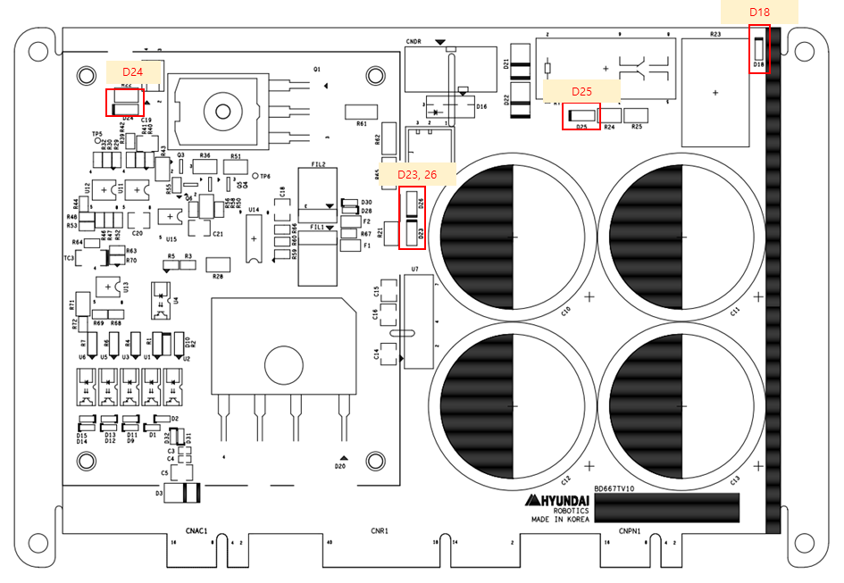

# 4.3.6.3. Display Devices

Figure 4.24 Display Devices of BD667T (PN Regenerative Discharge Module)
  

Table 4-27 Description of the Display Devices of BD667T (PN Regenerative Discharge Module)

<table>
<tbody>
<tr class="odd">
<td>
<strong>Name</strong>
</td>
<td>
<strong>State</strong>
</td>
<td>
<strong>Color</strong>
</td>
<td>
<strong>When normal</strong>
</td>
<td>
<strong>Actions to take when an abnormality occurs</strong>
</td>
</tr>
<tr class="even">
<td>
<strong>D24</strong>
</td>
<td>
Control signal for the discharge signal
</td>
<td>
Yellow
</td>
<td>
Turned off

Will be turned on when discharge occurs. (Motor off)
</td>
<td>
Phenomenon: Turned off when the motor is turned off

Action 1: Check the input voltage (15V).

Action 2: Visually check the element for any damage.

Action 3: Replace the BD667T board.
</td>
</tr>
<tr class="odd">
<td>
<strong>D23</strong>
</td>
<td>
15V power
</td>
<td>
Yellow
</td>
<td>
Yellow점등
</td>
<td>
Phenomenon: Turned off

Action 1: Check the input voltage (15V).

Action 2: Check the 4-pin output voltage of U7.

Action 3: Replace the BD667T board.
</td>
</tr>
<tr class="even">
<td>
<strong>D26</strong>
</td>
<td>
Regenerative discharge operation
</td>
<td>
Yellow
</td>
<td>
Turned off

Will be turned on when discharge occurs. (Motor off)
</td>
<td>
Phenomenon: Yellow LED turned on, or blinking occurs without the robot being operated.

Action 1: Check the R54 voltage setting.

Action 2: Check the 5.45V regenerative discharge voltage setting.

Action 3: Replace the BD667T board.
</td>
</tr>
<tr class="odd">
<td>
<strong>D25</strong>
</td>
<td>
Discharge resistor relay drive state 

</td>
<td>
Yellow
</td>
<td>
Will be turned on right after the power is turned on.
Will be then turned off after a while.
Will be turned on when the motor is turned off. 
</td>
<td>
Continues to be turned on, or will be turned off when the motor is turned off.

Action 1: Check the input voltage (15V).

Action 2: Check the safety relay (RY 1) NC state.

Action 3: Replace the BD667T board.
</td>
</tr>
<tr class="even">
<td>
<strong>D18</strong>
</td>
<td>
PN power state
</td>
<td>
Green
</td>
<td>
Green LED turned on
</td>
<td>
Phenomenon: Turned off

Action 1: Check the 220VAC power supply of the BD602T board.

Action 2: Replace the BD667T.
</td>
</tr>
</tbody>
</table>