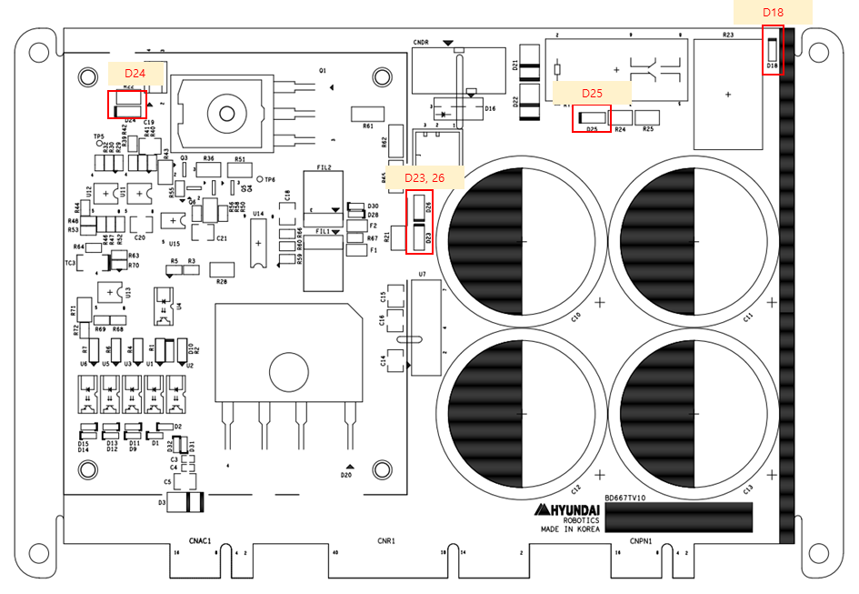

# 4.3.6.3. 显示设备

图 4.24 BD667T 的显示设备 (PN 再生放电模块)
  

表 4-27 BD667T 显示设备的描述 (PN 再生放电模块)

<table>
<tbody>
<tr class="odd">
<td>
<strong>名称</strong>
</td>
<td>
<strong>状态</strong>
</td>
<td>
<strong>颜色</strong>
</td>
<td>
<strong>正常时</strong>
</td>
<td>
<strong>发生异常时的应对措施</strong>
</td>
</tr>
<tr class="even">
<td>
<strong>D24</strong>
</td>
<td>
放电信号的控制信号
</td>
<td>
黄色
</td>
<td>
关闭

发生放电时将开启。 (电机关闭)
</td>
<td>
现象：电机关闭时关闭

行动 1：检查输入电压 (15V)。

行动 2：目视检查元件是否有损坏。

行动 3：更换 BD667T 板。
</td>
</tr>
<tr class="odd">
<td>
<strong>D23</strong>
</td>
<td>
15V 电源
</td>
<td>
黄色
</td>
<td>
黄色点亮
</td>
<td>
现象：关闭

行动 1：检查输入电压 (15V)。

行动 2：检查 U7 的 4 针输出电压。

行动 3：更换 BD667T 板。
</td>
</tr>
<tr class="even">
<td>
<strong>D26</strong>
</td>
<td>
再生放电操作
</td>
<td>
黄色
</td>
<td>
关闭

发生放电时将开启。 (电机关闭)
</td>
<td>
现象：黄色 LED 点亮，或在机器人未操作的情况下发生闪烁。

行动 1：检查 R54 电压设置。

行动 2：检查 5.45V 再生放电电压设置。

行动 3：更换 BD667T 板。
</td>
</tr>
<tr class="odd">
<td>
<strong>D25</strong>
</td>
<td>
放电电阻器继电器驱动状态
</td>
<td>
黄色
</td>
<td>
在电源开启后会立即开启。
过一段时间后会关闭。
在电机关闭时会重新开启。
</td>
<td>
持续开启，或者在电机关闭时会关闭。

行动 1：检查输入电压 (15V)。

行动 2：检查安全继电器 (RY 1) NC 状态。

行动 3：更换 BD667T 板。
</td>
</tr>
<tr class="even">
<td>
<strong>D18</strong>
</td>
<td>
PN 电源状态
</td>
<td>
绿色
</td>
<td>
绿色 LED 灯已开启
</td>
<td>
现象：已关闭

行动 1：检查 BD602T 板的 220VAC 电源。

行动 2：更换 BD667T。
</td>
</tr>
</tbody>
</table>