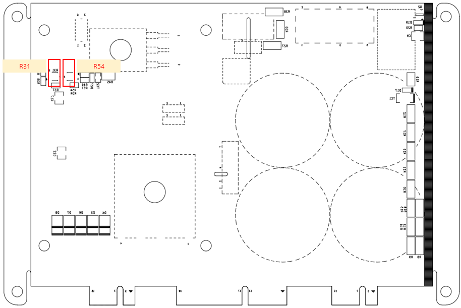

# 4.3.6.4. Setting Devices

Figure 4.25 Description of the Setting Devices of BD667T (PN Regenerative Discharge Module)
  

<table>
<thead>
  <tr>
    <th>Name</th>
    <th>Contents of setting</th>
    <th>Setting value</th>
    <th>Setting method</th>
  </tr>
</thead>
<tbody>
  <tr>
    <td>R31</td>
    <td>Setting of the voltage value for overvoltage monitoring</td>
    <td>5.7V(392V)</td>
    <td>Set the voltage between Pin 2 of the resistor and the GND to be 5.7V by turning the variable resistor R31, while keeping a multimeter attached.</td>
  </tr>
  <tr>
    <td>R54</td>
    <td>Setting of the regenerative discharge operation voltage</td>
    <td>5.45V(375V)</td>
    <td>Set the voltage between Pin 2 of the resistor and the GND to be 5.45V by turning the variable resistor R31, while keeping a multimeter attached.</td>
  </tr>
</tbody>
</table>

