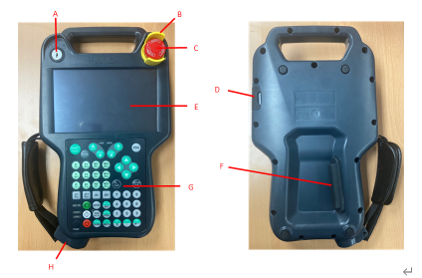

# 4.3.6.1. Overview

The teach pendant (TP630) communicates with the main module (H6COM-T) of the controller through Ethernet and allows the user to directly operate the following functions.

*	Monitoring	: Job program / Data of each axis / Input and output signals / Status of the robot, etc.

*	Log management 	: System version, operation time, error log, stop log, etc.

*	File management 	: Version and teach program up/down

*	Setting of various variables : User environment / control / robot / application / automatic integer, etc.

*	Robot teaching 	: Jog and teach program registration

*	Robot operation 	: Motor on / start / stop / mode settings

The teach pendant is also equipped with a three-stage enable switch and emergency stop switch to ensure user safety.

In addition, a USB A type connector is mounted under the rubber cover at the bottom of the teach pendant, allowing the user to upload/download necessary files, such as data and teaching programs, as well as versions of diverse types of boards using a USB memory stick.

Figure 4.26 Exterior of the Teach Pendant TP630

<table>
<tbody>
<tr class="odd">
<td>
<strong>Sign</strong>
</td>
<td>
<strong>Name</strong>
</td>
<td>
<strong>Specification</strong>
</td>
</tr>
<tr class="even">
<td>
<strong>A</strong>
</td>
<td>
Mode switch
</td>
<td>
3-Position rotary switch
</td>
</tr>
<tr class="odd">
<td>
<strong>B</strong>
</td>
<td>
Emergency stop button guard
</td>
<td>
Option
</td>
</tr>
<tr class="even">
<td>
<strong>C</strong>
</td>
<td>
Emergency stop button
</td>
<td>
Push lock type
</td>
</tr>
<tr class="odd">
<td>
<strong>D</strong>
</td>
<td>
USB port
</td>
<td>
1 channel (2.0)
</td>
</tr>
<tr class="even">
<td>
<strong>E</strong>
</td>
<td>
Touch screen
</td>
<td>
7inch
</td>
</tr>
<tr class="odd">
<td>
<strong>F</strong>
</td>
<td>
Dead man’s switch
</td>
<td>
3Dot type switch
</td>
</tr>
<tr class="even">
<td>
<strong>G</strong>
</td>
<td>
Keypad
</td>
<td>
-
</td>
</tr>
<tr class="even">
<td>
<strong>H</strong>
</td>
<td>
Connector
</td>
<td>
-
</td>
</tr>
</tbody>
</table>