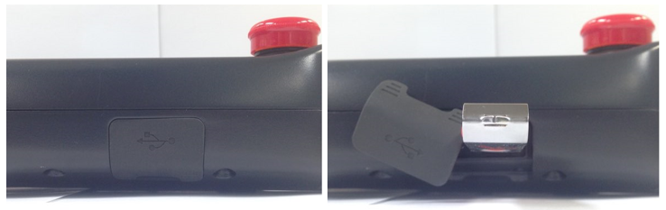

# 4.3.7.2. USB Cover 

There is a USB A type connector mounted under the rubber cover at the bottom of the teach pendant, allowing the user to upload/download necessary files, such as versions of diverse types of boards, as well as data and teaching programs, using a USB memory stick.

Figure 4.27 USB Cover of the Teach Pendant TP630


Keep the rubber cover of the USB port closed when not using the port.

 
