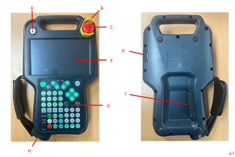

# 4.3.7.1. 개요

티치펜던트(TP630)는 제어기의 메인모듈(H6COM)과 이더넷으로 통신하며, 다음과 같은 기능을 사용자가 직접 조작할 수 있도록 합니다.

* 모니터링   : 작업프로그램 / 각 축 데이터 / 입출력 신호 / 로봇 상태 등

* 이력 관리              : 시스템 버전, 가동시간, 에러이력, 정지이력 등

* 파일 관리              : 버전 & 티칭 프로그램 업/다운

* 각종 변수 설정       : 사용자 환경 / 제어 / 로봇 / 응용 / 자동정수 등

* 로봇 티칭              : 조그 & 티칭 프로그램 등록

* 로봇 조작              : MOTOR ON / START / STOP / MODE 설정

티치펜던트는 또한 사용자의 안전을 위하여 3단 인에이블스위치, 비상정지스위치 등을 장착하고 있습니다.

또한, 티치펜던트 하단 고무커버 아래 USB A type 커넥터가 장착되어 있으므로, 사용자는 USB Memory Stick을 이용하여 각종 보드류의 버전뿐만 아니라 데이터 및 티칭 프로그램 등 필요한 파일들을 업/다운 로드 할 수 있습니다.

그림 4.26 티치펜던트 TP630의 외관
  

<table>
<tbody>
<tr class="odd">
<td>
<strong>기호</strong>
</td>
<td>
<strong>명칭</strong>
</td>
<td>
<strong>사양</strong>
</td>
</tr>
<tr class="even">
<td>
<strong>A</strong>
</td>
<td>
모드 스위치
</td>
<td>
3-Position 로터리 스위치
</td>
</tr>
<tr class="odd">
<td>
<strong>B</strong>
</td>
<td>
비상정지 버튼 가드
</td>
<td>
옵션
</td>
</tr>
<tr class="even">
<td>
<strong>C</strong>
</td>
<td>
비상정지 버튼
</td>
<td>
푸시 락 타입
</td>
</tr>
<tr class="odd">
<td>
<strong>D</strong>
</td>
<td>
USB 포트
</td>
<td>
1채널 (2.0)
</td>
</tr>
<tr class="even">
<td>
<strong>E</strong>
</td>
<td>
터치스크린
</td>
<td>
7인치
</td>
</tr>
<tr class="odd">
<td>
<strong>F</strong>
</td>
<td>
데드맨스위치
</td>
<td>
3점식 스위치
</td>
</tr>
<tr class="even">
<td>
<strong>G</strong>
</td>
<td>
키패드
</td>
<td>
-
</td>
</tr>
<tr class="even">
<td>
<strong>H</strong>
</td>
<td>
커넥터
</td>
<td>
-
</td>
</tr>
</tbody>
</table>