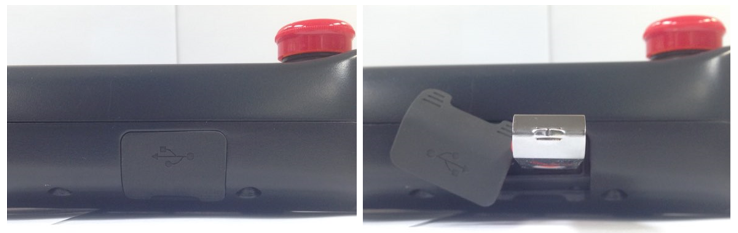

# 4.3.7.2. USB 커버

티치펜던트 하단 *고무커버 아래 USB A type 커넥터가 장착되어 있으므로, 사용자는 USB Memory Stick을 이용하여 각종 보드류의 버전뿐만 아니라 데이터 및 티칭 프로그램 등 필요한 파일들을 업/다운 로드 할 수 있습니다.

그림 4.27 티치펜던트 TP630의 USB 커버


사용하지 않을 때는 USB 포트의 고무커버를 닫아 두십시오
