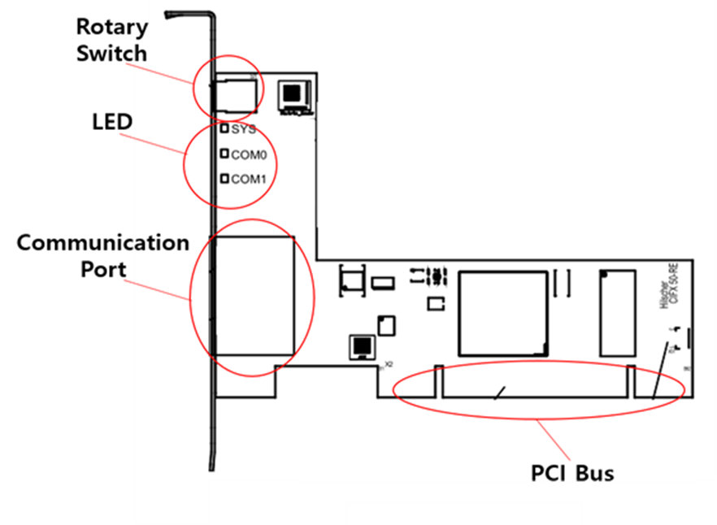

# 5.1.2. Configuration of the PCI Communication Card

A PCI communication card is basically configured, as shown below (when Ethernet-based communication is used), and varies in the number of connectors and LEDs depending on the type of industrial communication.

Figure 5.1 Exterior of the PCI Communication Card  

Table 5-2 Description of the Exterior of the PCI Communication Card

<table>
<thead>
  <tr>
    <th>Name</th>
    <th>Usage</th>
  </tr>
</thead>
<tbody>
  <tr>
    <td>Rotary Switch</td>
    <td>Sets the communication according to the slot ID</td>
  </tr>
  <tr>
    <td>LED</td>
    <td>Displays the system and communication status</td>
  </tr>
  <tr>
    <td>Communication Port</td>
    <td>Communication connection port</td>
  </tr>
  <tr>
    <td>PCI Bus</td>
    <td>PC connection bus</td>
  </tr>
</tbody>
</table>
