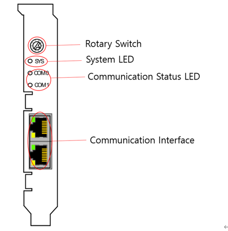

# 5.1.3. Front Part of the PCI Communication Card

You can check the communication setting, communication cable connection, and communication status through the front part of the PCI communication card. Basically, you can use the card by setting the rotary switch to 1-4 in order according to the location of the H6COM PCI slot.

Figure 5.2 Front Part of the PCI Communication Card  

Table 5-3 Configuration of the Front Part of the PCI Communication Card, and the Description of the Functions

<table>
<thead>
  <tr>
    <th>Name</th>
    <th>Usage</th>
    <th>Description of Functions</th>
  </tr>
</thead>
<tbody>
  <tr>
    <td>Rotary Switch</td>
    <td>Sets the communication for each slot number</td>
    <td>H6COM-T PCI slots are fixed as #1~#4 sequentially starting from the one at the top (Communication to be set from TP).</td>
  </tr>
  <tr>
    <td>System LED</td>
    <td>System status checking LED</td>
    <td>Green: System in operation Yellow: Boot loader waiting
</td>
  </tr>
  <tr>
    <td>Communication Status LED</td>
    <td>Communication status checking LED</td>
    <td>Green: Communication in operation Red: Communication error
</td>
  </tr>
  <tr>
    <td>Communication Interface</td>
    <td>Communication cable connection port</td>
    <td>Use of connectors suitable for communication</td>
  </tr>
</tbody>
</table>
