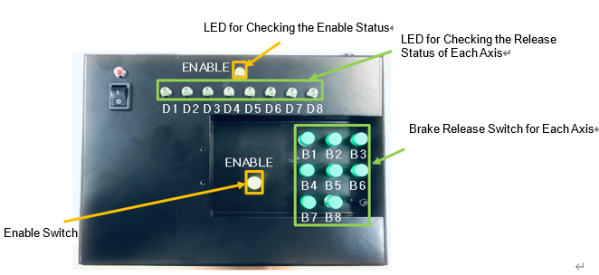

# 5.2.2. Brake Release Switch

The placement of the switches of the brake release unit is as shown in Figure 5.3, and their individual usage and operation are described in Table 5-4. To release the brake of the targeted axis, first press the Enable button, and then, while pressing the Enable button, press one of the buttons B1–B8 at the same time. Then, the relevant axis will be released.

Figure 5.3 Switches and Status Checking LEDs of the Brake Release Unit  

Table 5-4 Usage of the Switches of the Brake Release Unit 

<table>
<thead>
  <tr>
    <th>Name</th>
    <th>Usage</th>
    <th>During operation</th>
  </tr>
</thead>
<tbody>
  <tr>
    <td>E</td>
    <td>Brake Release Enable</td>
    <td>Yellow Enable LED ON</td>
  </tr>
  <tr>
    <td>B1</td>
    <td>Axis 1 Brake Release</td>
    <td>Green D1 LED ON</td>
  </tr>
  <tr>
    <td>B2</td>
    <td>Axis 2 Brake Release</td>
    <td>Green D2 LED ON</td>
  </tr>
  <tr>
    <td>B3</td>
    <td>Axis 3 Brake Release</td>
    <td>Green D3 LED ON</td>
  </tr>
  <tr>
    <td>B4</td>
    <td>Axis 4 Brake Release</td>
    <td>Green D4 LED ON</td>
  </tr>
  <tr>
    <td>B5</td>
    <td>Axis 5 Brake Release</td>
    <td>Green D5 LED ON</td>
  </tr>
  <tr>
    <td>B6</td>
    <td>Axis 6 Brake Release</td>
    <td>Green D6 LED ON</td>
  </tr>
  <tr>
    <td>B7</td>
    <td>Axis 7 Brake Release</td>
    <td>Green D7 LED ON</td>
  </tr>
  <tr>
    <td>B8</td>
    <td>Axis 8 Brake Release</td>
    <td>Green D8 LED ON</td>
  </tr>
</tbody>
</table>
