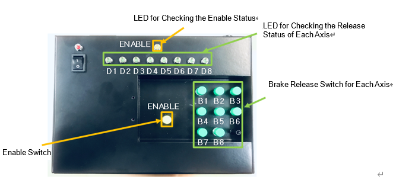

# 5.2.2. 制动释放开关

制动释放单元的开关布局如图 5.3 所示，各自的使用和操作在表 5-4 中进行了描述。要释放目标轴的制动，首先按下启用按钮，然后在按住启用按钮的同时，同时按下 B1-B8 中的一个按钮。然后，相应的轴将被释放。

图 5.3 制动释放单元的开关和状态检查 LED  

表 5-4 制动释放单元开关的使用 

<table>
<thead>
  <tr>
    <th>名称</th>
    <th>使用</th>
    <th>操作期间</th>
  </tr>
</thead>
<tbody>
  <tr>
    <td>E</td>
    <td>制动释放启用</td>
    <td>黄色启用 LED 亮</td>
  </tr>
  <tr>
    <td>B1</td>
    <td>轴 1 制动释放</td>
    <td>绿色 D1 LED 亮</td>
  </tr>
  <tr>
    <td>B2</td>
    <td>轴 2 制动释放</td>
    <td>绿色 D2 LED 亮</td>
  </tr>
  <tr>
    <td>B3</td>
    <td>轴 3 制动释放</td>
    <td>绿色 D3 LED 亮</td>
  </tr>
  <tr>
    <td>B4</td>
    <td>轴 4 制动释放</td>
    <td>绿色 D4 LED 亮</td>
  </tr>
  <tr>
    <td>B5</td>
    <td>轴 5 制动释放</td>
    <td>绿色 D5 LED 亮</td>
  </tr>
<tr>
    <td>B6</td>
    <td>轴 6 刹车释放</td>
    <td>绿色 D6 LED 开</td>
  </tr>
  <tr>
    <td>B7</td>
    <td>轴 7 刹车释放</td>
    <td>绿色 D7 LED 开</td>
  </tr>
  <tr>
    <td>B8</td>
    <td>轴 8 刹车释放</td>
    <td>绿色 D8 LED 开</td>
  </tr>
</tbody>
</table>