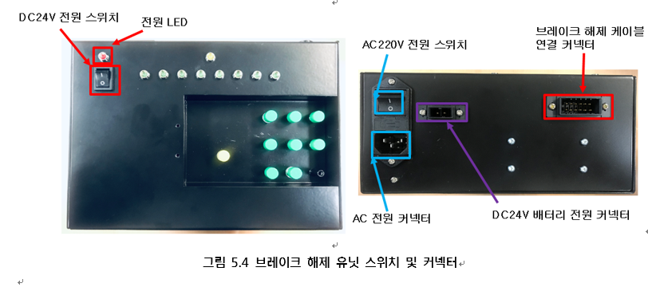

# 5.2.3. Power and Connectors 

The placement of the power and connectors of the brake release unit is as shown in Figure 5.4 below, and their individual usage and connection devices are as shown in Table 5-5 below.


- When using the brake release unit, follow the procedures below.
1. Turn off the AC220V power switch and check that the DC24V power switch is turned off.
2. Connect the AC power cable to the AC power connector.
3. Turn on the AC220V power switch.
4. Turn on the DC24V power switch.
- When the use of the brake release unit is finished, follow the procedures below.
1. Turn off the DC24V power switch.
2. Turn off the AC220V power switch.
4. Disconnect the AC power cable.
- Do not use AC220V power and DC24V battery power at the same time.



Our company (or the manufacturer) will not be responsible for any accidents that occur because of not complying with the above “caution.”


Figure 5.4 Switches and Connectors of the Brake Release Unit  

Table 5-5 Types and Usage of the Connectors of the Brake Release Unit

<table>
<thead>
  <tr>
    <th>Name</th>
    <th>Usage</th>
    <th>Connection of external devices</th>
  </tr>
</thead>
<tbody>
  <tr>
    <td>AC 220V power connector and switch</td>
    <td>Application of the AC power</td>
    <td>100V AC~240V AC Single phase</td>
  </tr>
  <tr>
    <td>Brake release cable connection connector</td>
    <td>Connection of the brake release unit and controller</td>
    <td>CNBA1, and CNBA2 of BD602T</td>
  </tr>
  <tr>
    <td>DC24V battery power connector</td>
    <td>Connection of the power of a portable 24V battery</td>
    <td>Portable 24V battery</td>
  </tr>
  <tr>
    <td>DC24V power switch</td>
    <td>Brake release unit drive on/off</td>
    <td>None</td>
  </tr>
</tbody>
</table>
