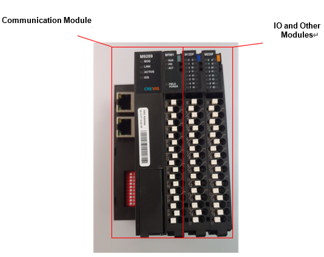

# 5.3.1. 개요

Hi6-T15 제어기에서 범용 IO 신호를 사용하기 위해서 상용 리모트 IO가 필요합니다. 상용 리모트 IO는 기본적으로 “통신모듈” 1개에 “IO 모듈”(사용자 선택)을 연결하여 사용합니다. 아래의 모듈은 Crevis사의 상용 리모트 IO 모듈을 소개해 놓았으며, 타사의 상용 리모트 IO를 구매하여 사용하여도 무방합니다. 자세한 사용법은 구매하신 IO업체에 요청하시면 됩니다.


상용 리모트 IO를 사용하기 위해서는 필드버스 통신이 반드시 필요 합니다. 따라서, 위에 언급된 ‘5.1. PCI 통신카드’을 참고하여 PCI 통신 카드를 같이 구성하시기 바랍니다.


그림 5.5상용 리모트 IO 구성 예시
