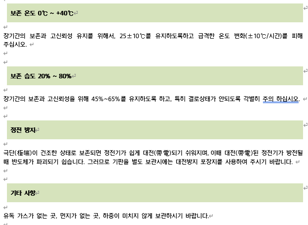

# 6.7. Maintenance Parts 

The characteristics of individual parts are described below. 

**Maintenance Parts of the Category A**


These are the important parts to be prepared for daily maintenance and inspection.


To maintain normal operation, the parts of the category A-2 and parts of the category A-3 are the minimum necessary parts, and at least one set of each group should be prepared.

Table 6-4 Inspection of Maintenance Parts of the Category A 

<table>
<thead>
  <tr>
    <th>Type</th>
    <th>Contents</th>
    <th>Remarks (Reference)</th>
  </tr>
</thead>
<tbody>
  <tr>
    <td>Maintenance parts of the category A-1</td>
    <td>Spare parts for standard parts</td>
    <td></td>
  </tr>
  <tr>
    <td>Maintenance parts of the category A-2</td>
    <td>Important backup parts</td>
    <td></td>
  </tr>
  <tr>
    <td>Maintenance parts of the category A-3</td>
    <td>Periodic replacement parts</td>
    <td></td>
  </tr>
</tbody>
</table>

Table 6-5 Maintenance Parts of the Category A-1 (Spare Parts for Standard Parts) 

<table>
<thead>
  <tr>
    <th>No.</th>
    <th>Part name</th>
    <th>Type</th>
    <th>Maker</th>
    <th>Quantity(EA)</th>
    <th>Remarks</th>
  </tr>
</thead>
<tbody>
  <tr>
    <td>1</td>
    <td>Fuse (F1,F2)</td>
    <td>GP75 (250V, 7.5A)</td>
    <td>Daito</td>
    <td>2</td>
    <td>BD6C2</td>
  </tr>
  <tr>
    <td>2</td>
    <td>Fuse (F3,F4)</td>
    <td>GP75 (250V, 7.5A)</td>
    <td>Daito</td>
    <td>2</td>
    <td>BD6C2</td>
  </tr>
  <tr>
    <td>3</td>
    <td>Fuse (F5,F6)</td>
    <td>GP75 (250V, 7.5A)</td>
    <td>Daito</td>
    <td>2</td>
    <td>BD6C2</td>
  </tr>
</tbody>
</table>

Table 6-6 Maintenance Parts of the Category A-2 (Important Backup Parts) 

<table>
<thead>
  <tr>
    <th>No.</th>
    <th>Part name</th>
    <th>Type</th>
    <th>Maker</th>
    <th>Quantity(EA)</th>
    <th>Remarks</th>
  </tr>
</thead>
<tbody>
  <tr>
    <td>1</td>
    <td>Robot Controller</td>
    <td>H6COM-T</td>
    <td>Hyundai Robotics</td>
    <td>1</td>
    <td><td>
  </tr>
  <tr>
    <td>2</td>
    <td>Safety IO Board</td>
    <td>BD632T</td>
    <td>Hyundai Robotics</td>
    <td>1</td>
    <td></td>
  </tr>
  <tr>
    <td>3</td>
    <td>Servo Control Board</td>
    <td>BD641T</td>
    <td>Hyundai Robotics</td>
    <td>1</td>
    <td></td>
  </tr>
  <tr>
    <td>4</td>
    <td>AMP Board</td>
    <td>BD657T /BD658T</td>
    <td>Hyundai Robotics</td>
    <td>1</td>
    <td></td>
  </tr>
  <tr>
    <td>5</td>
    <td>Backplane Board</td>
    <td>BD602T</td>
    <td>Hyundai Robotics</td>
    <td>1</td>
    <td></td>
  </tr>
  <tr>
    <td>6</td>
    <td>Power Rectifier Board</td>
    <td>BD667T</td>
    <td>Hyundai Robotics</td>
    <td>1</td>
    <td></td>
  </tr>
  <tr>
    <td>7</td>
    <td>Teach pendant</td>
    <td>TP630</td>
    <td>Hyundai Robotics</td>
    <td>1</td>
    <td></td>
  </tr>

</tbody>
</table>

Table 6-7 Maintenance Parts of the Category A-3 (Periodic Replacement Parts) 

<table>
<tbody>
<tr class="odd">
<td>
<strong>No.</strong>
</td>
<td>
<strong>Part name</strong>
</td>
<td>
<strong>Type</strong>
</td>
<td>
<strong>Maker</strong>
</td>
<td>
<strong>Quantity(EA)</strong>
</td>
<td>
<strong>Remarks</strong>
</td>
</tr>
<tr class="even">
<td>
1
</td>
<td>
Battery(3.6V AA Size)
</td>
<td>
ER6V-T1
</td>
<td>
TOSHIBA (JAPAN)
</td>
<td>
1
</td>
<td>
Replace it every two years
</td>
</tr>
</tbody>
</table>

**Maintenance Parts of the Category B**


These are the maintenance parts to be prepared when multiple units are purchased.


Table 6-8 Maintenance Parts of the Category B 

<table>
<tbody>
<tr class="odd">
<td>
<strong>Type</strong>
</td>
<td>
<strong>Contents</strong>
</td>
<td>
<strong>Remarks (Reference)</strong>
</td>
</tr>
<tr class="even">
<td>
Maintenance parts of the category B-1
</td>
<td>
Parts that should be purchased from Hyundai Robotics
</td>
<td></td>
</tr>
<tr class="odd">
<td>
Maintenance parts of the category B-2
</td>
<td>
Parts that can be purchased directly from the parts maker
</td>
<td></td>
</tr>
</tbody>
</table>

Table 6-9 Maintenance Parts of the Category B-1 (Parts that should be purchased from Hyundai Robotics)

<table>
<thead>
  <tr>
    <th>No.</th>
    <th>Part Name</th>
    <th>Type</th>
    <th>Maker</th>
    <th>Quantity(EA)</th>
    <th>Remarks</th>
  </tr>
</thead>
<tbody>
  <tr>
    <td>1</td>
    <td>Wire harness</td>
    <td>CMEC1</td>
    <td>Hyundai Robotics</td>
    <td>1</td>
    <td></td>
  </tr>
  
</tbody>
</table>

Table 6-10 Maintenance Parts of the Category B-2 (Parts that can be purchased directly from the parts maker)

<table>
<tbody>
<tr class="odd">
<td>
<strong>No.</strong>
</td>
<td>
<strong>Part Name</strong>
</td>
<td>
<strong>Type</strong>
</td>
<td>
<strong>Maker</strong>
</td>
<td>
<strong>Quantity(EA)</strong>
</td>
<td>
<strong>Remarks</strong>
</td>
</tr>
<tr class="even">
<td>
<strong>1</strong>
</td>
<td>
No fuse breaker (NFB)
</td>
<td>
-
</td>
<td>
-
</td>
<td>
1
</td>
<td></td>
</tr>
<tr class="odd">
<td>
<strong>2</strong>
</td>
<td>
Magnetic contact (MC1, MC2)
</td>
<td>
-
</td>
<td>
-
</td>
<td>
2
</td>
<td></td>
</tr>
<tr class="even">
<td>
<strong>3</strong>
</td>
<td>
Circuit protector (CP1)
</td>
<td>
-
</td>
<td>
-
</td>
<td>
1
</td>
<td></td>
</tr>
</tbody>
</table>


Considering that the boards are equipped with high-performance parts, take precautions about the following items for carrying out maintenance.


