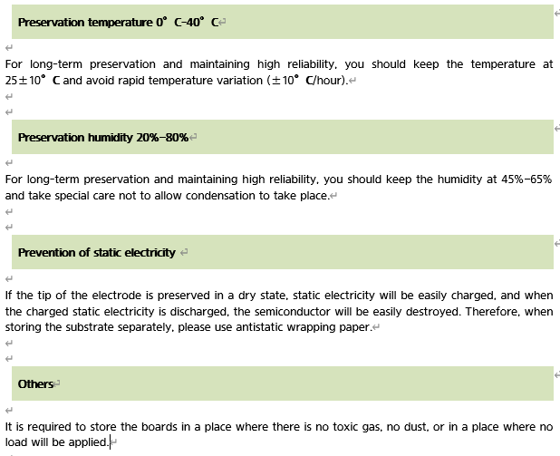

# 6.7. 보수 부품 항목

각 부품들의 특성을 설명합니다.

**보수 부품 A**


일상적 보수점검으로서 준비해야 할 중요 부품입니다.


통상의 운전을 유지하기 위해서는 위 부품A-2, 부품A-3은 최소한의 필요한 부품이며 1 set이상을 준비하여 주십시오.

표 6-4 보수 부품 점검 A

<table>
<thead>
  <tr>
    <th>종류</th>
    <th>내용</th>
    <th>비고 (참조)</th>
  </tr>
</thead>
<tbody>
  <tr>
    <td>보수 부품 A-1</td>
    <td>표준 부속 예비 부품</td>
    <td></td>
  </tr>
  <tr>
    <td>보수 부품 A-2</td>
    <td>중요 백업 부품</td>
    <td></td>
  </tr>
  <tr>
    <td>보수 부품 A-3</td>
    <td>정기 교환 부품</td>
    <td></td>
  </tr>
</tbody>
</table>

표 6-5 보수 부품 A-1 (표준 부속 예비 부품)

<table>
<thead>
  <tr>
    <th>No.</th>
    <th>품명</th>
    <th>형식</th>
    <th>Maker</th>
    <th>수량(EA)</th>
    <th>비고</th>
  </tr>
</thead>
<tbody>
  <tr>
    <td>1</td>
    <td>Fuse (F1,F2)</td>
    <td>GP75(250V, 7.5A)</td>
    <td>Daito</td>
    <td>2</td>
    <td>BD6C2</td>
  </tr>
  <tr>
    <td>2</td>
    <td>Fuse (F3,F4)</td>
    <td>GP75(250V, 7.5A)</td>
    <td>Daito</td>
    <td>2</td>
    <td>BD6C2</td>
  </tr>
  <tr>
    <td>3</td>
    <td>Fuse (F5,F6)</td>
    <td>GP75(250V, 7.5A)</td>
    <td>Daito</td>
    <td>2</td>
    <td>BD6C2</td>
  </tr>
</tbody>
</table>

표 6-6 보수 부품 A-2 (중요 백업부품)

<table>
<thead>
  <tr>
    <th>No.</th>
    <th>품 명</th>
    <th>형 식</th>
    <th>Maker</th>
    <th>수량(EA)</th>
    <th>비고</th>
  </tr>
</thead>
<tbody>
  <tr>
    <td>1</td>
    <td>로봇제어기</td>
    <td>H6COM-T</td>
    <td>현대로보틱스</td>
    <td>1</td>
    <td></td>
  </tr>
  <tr>
    <td>2</td>
    <td>안전IO보드</td>
    <td>BD632T</td>
    <td>현대로보틱스</td>
    <td>1</td>
    <td></td>
  </tr>
  <tr>
    <td>3</td>
    <td>서보제어보드</td>
    <td>BD641T</td>
    <td>현대로보틱스</td>
    <td>1</td>
    <td></td>
  </tr>
  <tr>
    <td>4</td>
    <td>앰프보드</td>
    <td>BD657T/BD658T</td>
    <td>현대로보틱스</td>
    <td>1</td>
    <td></td>
  </tr>
  <tr>
    <td>5</td>
    <td>백플레인보드</td>
    <td>BD602T</td>
    <td>현대로보틱스</td>
    <td>1</td>
    <td></td>
  </tr>
  <tr>
    <td>6</td>
    <td>파워정류보드</td>
    <td>BD667T</td>
    <td>현대로보틱스</td>
    <td>1</td>
  </tr>
  <tr>
    <td>7</td>
    <td>티치펜던트</td>
    <td>TP630</td>
    <td>현대로보틱스</td>
    <td>1</td>
  </tr>
</tbody>
</table>

표 6-7 보수 부품 A-3 (정기 교환 부품)

<table>
<tbody>
<tr class="odd">
<td>
<strong>No.</strong>
</td>
<td>
<strong>품명</strong>
</td>
<td>
<strong>형식</strong>
</td>
<td>
<strong>Maker</strong>
</td>
<td>
<strong>수량(EA)</strong>
</td>
<td>
<strong>비고</strong>
</td>
</tr>
<tr class="even">
<td>
1
</td>
<td>
전지 (3.6V AA Size)
</td>
<td>
ER6V-T1
</td>
<td>
TOSHIBA (JAPAN)
</td>
<td>
1
</td>
<td>
2년 주기 교환
</td>
</tr>
</tbody>
</table>

**보수부품 B**


여러 대 구입하는 경우에는 준비해야 할 보수 부품입니다.


표 6-8 보수 부품 점검 B

<table>
<tbody>
<tr class="odd">
<td>
<strong>종류</strong>
</td>
<td>
<strong>내용</strong>
</td>
<td>
<strong>비고 (참조)</strong>
</td>
</tr>
<tr class="even">
<td>
보수 부품 B-1
</td>
<td>
현대로보틱스에서 구입해야 할 부품
</td>
<td></td>
</tr>
<tr class="odd">
<td>
보수 부품 B-2
</td>
<td>
부품 Maker에게서 직접 구입 가능한 부품
</td>
<td></td>
</tr>
</tbody>
</table>

표 6-9 보수 부품 B-1 (현대로보틱스에서 구입해야 할 부품)

<table>
<thead>
  <tr>
    <th>No.</th>
    <th>품명</th>
    <th>형식</th>
    <th>Maker</th>
    <th>수량(EA)</th>
    <th>비고</th>
  </tr>
</thead>
<tbody>
  <tr>
    <td rowspan="3">1</td>
    <td rowspan="3">와이어 하네스</td>
    <td>CMEC1</td>
    <td>현대로보틱스</td>
    <td>1</td>
    <td>-</td>
  </tr>
</tbody>
</table>

표 6-10 보수 부품 B-2 (Maker에게서 직접 구입 가능한 부품)

<table>
<tbody>
<tr class="odd">
<td>
<strong>No.</strong>
</td>
<td>
<strong>품명</strong>
</td>
<td>
<strong>형식</strong>
</td>
<td>
<strong>Maker</strong>
</td>
<td>
<strong>수량(EA)</strong>
</td>
<td>
<strong>비고</strong>
</td>
</tr>
<tr class="even">
<td>
<strong>1</strong>
</td>
<td>
배선용 차단기(NFB)
</td>
<td>
-
</td>
<td>
-
</td>
<td>
1
</td>
<td></td>
</tr>
<tr class="odd">
<td>
<strong>2</strong>
</td>
<td>
전자 접촉기(MC1, MC2)
</td>
<td>
-
</td>
<td>
-
</td>
<td>
2
</td>
<td></td>
</tr>
<tr class="even">
<td>
<strong>3</strong>
</td>
<td>
회로 보호기 (CP1)
</td>
<td>
-
</td>
<td>
-
</td>
<td>
1
</td>
<td></td>
</tr>
</tbody>
</table>


기판은 고성능 부품을 실장하고 있기 때문에 보수를 위해서는 다음 사항들을 주의하여 주십시오.


